# AE 통합 AI 트레이딩 보조 시스템 (MVP)

본 프로젝트는 Toss증권 Open API와 코인원 API를 주요 거래소로 연동하여 국내·미국 주식 및 가상자산의 시세, 계좌, 보유자산, 주문 제안, 주문 실행 승인 흐름을 단일 대시보드와 RAG 기반 AI 챗봇으로 통합 관리하는 **AI 기반 트레이딩 보조 시스템**입니다.

실거래 자금이 유동하는 분산 환경에서 리스크를 원천 차단하기 위해 **Human-in-the-Loop(사용자 최종 승인)** 원칙과 고도의 보안 설계(양방향 AES-256-GCM 암호화, RLS 정책)를 적용하여 안전한 매매 제안 시스템을 구축했습니다.

---

## 🛠 Tech Stack (기술 스택)

### Frontend


### Backend


### Database &amp; Infra


### ML / MLOps


---

## 1. 주요 기능 및 비즈니스 로직 (Core Features &amp; Business Logic)

### 1.1 AI 트레이딩 챗봇 &amp; RAG 오케스트레이션

사용자와의 자연어 대화를 통해 주식/코인의 정보를 탐색하고, RAG 체인을 결합해 최적의 의사결정을 보조합니다.

- **투자 정보 RAG 가이드**: Naver News와 Finnhub 기사, DART 공시 분석 summaries 등을 벡터 검색 엔진(Supabase `match_knowledge_chunks` RPC)과 통합하여, 실시간 시세뿐만 아니라 최신 시장 소식과 공시를 결합한 컨텍스트 답변을 제공합니다.
- **Human-in-the-Loop 주문 승인**: AI가 자연어 분석을 통해 독자적으로 매매 주문을 실행하지 못하도록 격리했습니다. AI는 단지 `trade_proposals.status=PENDING` 상태의 매매 제안만 생성하며, React 프론트엔드가 Supabase Realtime을 통해 이를 실시간 구독하여 챗봇 내에 **주문 승인/거절 카드**를 렌더링합니다. 사용자의 명시적인 승인 버튼 클릭이 있어야 비로소 실거래가 실행됩니다.
- **원자적 선점 및 멱등성 보장**: 중복 클릭이나 네트워크 오류에 따른 중복 주문(Double-Spend)을 완벽히 방어합니다. Supabase RPC(원자적 프로시저 갱신)로 락을 걸어 최초 승인 이벤트만 처리하고, Toss/코인원 거래소 전송 시에는 UUID `client_order_id`를 멱등성 키로 함께 전송하여 중복 체결을 기술적으로 예방합니다.

### 1.2 다중 거래소 어댑터 및 자산 융합 대시보드

상이한 거래소 API의 스펙을 단일 인터페이스로 융합하고, 계좌와 자산을 한 화면에서 실시간 모니터링합니다.

- **거래소 어댑터 패턴**: `ExchangeClient` 추상 베이스 클래스를 구현하여 Toss Open API(OAuth 2.0 Client Credentials Grant, 계좌 시퀀스 조회 구조), KIS(레거시 주식), 코인원(HMAC-SHA512 Base64 서명), 바이낸스(HMAC-SHA256 signature 서명) 등 각기 다른 프로토콜의 호출 방식을 정규화된 자산/주문/시세 데이터셋으로 매핑했습니다.
- **TradingView Lightweight Charts 연동**: 프론트엔드가 개별 거래소 API에 의존하지 않고, 백엔드 단일 엔드포인트 `/api/chart/candles`를 호출하면 백엔드 어댑터가 시세를 캔들 데이터(`{ time, open, high, low, close }`)로 자동 보정하여 반환하고, 이를 Lightweight Charts 컴포넌트에 실시간 드로잉합니다. 단기 캐싱을 통해 렌더링 병목을 제거했습니다.
- **키 정보 양방향 암호화 및 RLS 격리**: 사용자의 거래소 API 키(Access Key/Secret Key)는 백엔드 내부의 대칭키(AES-256-GCM) 암호화를 거쳐 DB에 저장되며 프론트엔드로 절대 유출되지 않습니다. Supabase의 RLS(Row Level Security) 정책을 활성화하여 사용자는 오직 본인의 profile ID와 매핑된 개인 키 및 자산 내역만 접근할 수 있습니다.

### 1.3 조건감시 자동/반자동 매도 엔진

사용자가 미리 등록해 둔 기술적 조건에 따라 장중 시세를 지속적으로 모니터링하고 대응합니다.

- **실시간 조건식 기계적 감시**: 사용자가 명시적으로 설정한 수치적 조건식(예: 익절 +5%, 손절 -3%)을 백그라운드 워커(`auto_trading_rule_engine.py`)가 백그라운드 스레드에서 주기적으로 폴링하며 감시합니다.
- **실행 모드 분기**: 조건 도달 시 사용자에게 주문 전송 여부를 재차 확인하게 하는 `PROPOSAL` 모드와, 조건 즉시 실거래 매도 주문을 넣는 `AUTO` 모드를 유연하게 선택할 수 있습니다.
- **분산 락을 통한 독점 기동**: Gunicorn 다중 프로세스 환경에서 스케줄러가 중복 가동되어 감시 주기가 깨지거나 API 한도를 초과하지 않도록, Supabase `active_locks` 테이블 기반 분산 락(Distributed Lock) 시스템을 구현하여 중앙 프로세스 1개만 실행 독점권을 갖도록 보장합니다.

### 1.4 MLOps &amp; LightGBM 신호 예측 파이프라인

주식과 가상자산의 성격에 맞추어 모델을 분리 설계하고, 학습부터 검증 및 배포 패키징까지 자동화하였습니다.

- **주식/코인 예측 모델 지능적 분기**: 주식(국내: KIS 데이터 기반 `lgbm_kr_stock_signal_v1`, 해외: Toss 데이터 기반 `lgbm_us_stock_signal_v1`)과 코인(코인원/바이낸스 데이터 기반 `lgbm_crypto_signal_v9`) 예측 모델을 분리하였습니다. 영문 티커와 숫자 심볼 코드를 판별하여 적합한 서빙 모델로 지능적 라우팅을 수행합니다.
- **승격 검증(Promotion Check) 엔진**: 백그라운드 스레드 기반 스케줄러(`ml_scheduler.py`)가 주기적으로 학습을 돌린 후, `ml_split_model_promotion_service.py`를 통해 신규 모델의 CV ROC AUC, MDD, 초과수익률을 기존 Serving 모델과 비교 검증합니다. 통과한 모델만 서비스 레지스트리(`ml_model_registry`)에 승격(`Serving` 적용)시킵니다.
- **경량화 서빙 패키징**: EC2 프로덕션 배포 시 원시 대용량 CSV나 중간 정제 데이터를 배포하지 않고, 모델 바이너리, YAML 설정, 피처 순서 메타데이터 및 성능 요약만 단독으로 묶은 경량 서빙 패키지(`.tar.gz`)를 빌드하여 모델 유출 리스크와 배포 오버헤드를 낮추었습니다.

### 1.5 가상자산 해외 출금 사전검증 및 재정거래 안전 장치

거래소 간 자산 송금 시 발생 가능한 규제 위반 및 오송금 자산 소실 리스크를 사전 방지합니다.

- **트래블룰(Travel Rule) 규제 대응**: 국내법 및 가상자산 트래블룰을 준수하기 위해 사전에 코인원 거래소 공식 채널에 등록된 바이낸스 XRP 지갑 화이트리스트 주소와 데스티네이션 태그(Destination Tag)만을 대조하는 사전검증(Precheck) 모듈을 설계하여 임의 주소 송금을 원천 차단합니다.
- **슬리피지 방어(Slippage Protection) 시스템**: 코인원에서 XRP 매수 및 송금 후, 바이낸스 입금 확인 API(`GET /sapi/v1/capital/deposit/hisrec`)를 실시간 폴링하여 입금이 확인된 시점에 즉각 바이낸스 시장가/지정가 매도를 연계합니다. 이 때 블록체인 트랜잭션 대기 시간 동안 시세가 급락하여 코인원 매수 단가 대비 일정 손실 한도(예: -1.5%)를 초과할 경우, 매도를 중단하고 자산을 보류해 추가 손실을 예방하는 안전 필터를 갖췄습니다.

---

## 2. 시스템 아키텍처 (Architecture Diagram)

시스템의 전체 데이터 흐름 및 상호작용은 아래와 같습니다.

```mermaid
graph TD
    subgraph Frontend ["React 19 + Tailwind v4 Frontend"]
        Dashboard["Dashboard / AssetDetail / AdminMlData"]
        SBClient["Supabase SDK (Realtime 구독)"]
    end

    subgraph Gateway ["Flask API Gateway (Gunicorn)"]
        App["backend/app.py"]
        Routes["home / keys / ml / news / disclosures / trade / transfer"]
    end

    subgraph Worker ["Background Worker Processes"]
        WorkerMain["backend/worker.py"]
        MLScheduler["ml_scheduler.py (데이터 수집 & 학습)"]
        MarketScheduler["market_snapshot_scheduler.py"]
        AutoExitScheduler["auto_trading_rule_engine.py (자동/반자동 매도)"]
    end

    subgraph Supabase ["Supabase Cloud / Database"]
        DB[(PostgreSQL)]
        UserKeys["user_api_keys (양방향 암호화)"]
        TokenCaches["token_caches (OAuth 토큰 DB 캐싱)"]
        Locks["active_locks (분산 락)"]
        NewsArticles["news_articles"]
        Registry["ml_model_registry"]
        AutoRules["auto_trading_rules"]
        TradeProposals["trade_proposals"]
    end

    subgraph External ["External APIs"]
        Toss["Toss Open API (주 주식 브로커)"]
        KIS["KIS API (보류/레거시 주식)"]
        Coinone["Coinone API (주 코인 브로커)"]
        Binance["Binance API (선물/해외 코인)"]
        Naver["Naver News / Finnhub"]
    end

    Dashboard -->|REST API| App
    Dashboard -->|Auth / Realtime DB| SBClient
    App --> Routes
    Routes --> DB
    Routes --> Toss
    Routes --> Coinone
    Routes --> Binance

    WorkerMain --> MLScheduler
    WorkerMain --> MarketScheduler
    WorkerMain --> AutoExitScheduler

    MLScheduler --> Locks
    MLScheduler --> TokenCaches
    MLScheduler --> Registry
    MLScheduler --> Toss

    AutoExitScheduler --> Locks
    AutoExitScheduler --> AutoRules
    AutoExitScheduler --> UserKeys
    AutoExitScheduler --> TradeProposals
    AutoExitScheduler --> Toss
    AutoExitScheduler --> Coinone

    Routes --> NewsArticles
    MLScheduler --> NewsArticles
```



---

## 프로젝트 구조 (Directory Structure)

본 리포지토리는 프론트엔드(`frontend`), 백엔드 API 게이트웨이 및 워커(`backend`), 그리고 머신러닝 학습 모델 파이프라인(`ml`) 디렉토리로 구성됩니다. 

상세한 파일 및 디렉토리 명세는 [**프로젝트 디렉토리 구조 명세서(project_structure.md)**](docs/project_structure.md) 문서를 통해 확인할 수 있습니다.

### 핵심 진입 파일

- [**app.py**](backend/app.py): 백엔드 API Gateway 진입 파일.
- [**worker.py**](backend/worker.py): 백그라운드 스케줄러/감시 엔진의 단일 진입 파일.
- [**frontend/src/main.jsx**](frontend/src/main.jsx): 프론트엔드 React 19 SPA 진입점.
- [**ml/src/run_pipeline_bundle.py**](ml/src/run_pipeline_bundle.py): 머신러닝 학습 파이프라인 기동 스크립트.

---

## 5. 핵심 MLOps 배포 및 품질 관리 명령어

### ML 자동화 파이프라인 구동 및 서빙 배포 패키징

머신러닝 학습 및 검증이 완료되면, 보안을 위해 전체 학습 데이터(raw CSV 등)를 클라우드에 노출하지 않고, 추론에 필요한 피처 순서, 설정 YAML, 모델 파일, 성능 해시 메타데이터가 단독으로 묶인 **경량화 서빙 패키지**를 생성하여 EC2로 배포합니다.

- **LightGBM 통합 수집/학습 파이프라인 가동**:
  ```bash
  python ml/src/run_pipeline_bundle.py \
    --config ml/configs/lgbm_stock_v11.yaml \
    --risk-config ml/configs/lgbm_stock_risk_v11.yaml \
    --summary-output ml/data/processed/stock_v11_summary.json
  ```
- **EC2 배포용 Serving Package 생성**:
  ```bash
  python3 -m ml.src.export_serving_package \
    --asset-key kr_stock \
    --output-root ml/serving_packages \
    --no-predictions \
    --archive
  ```

### 테스트 및 품질 검증 (ESLint &amp; Pytest)

프론트엔드는 비즈니스 로직(Model.js)을 뷰와 분리하여 Node 단위 테스트의 안정성을 유지하며, ESLint 검증을 통해 경고를 완전히 배제한 품질 상태(0 errors, 0 warnings)를 지향합니다.

- **백엔드 유닛 테스트 실행**:
  ```bash
  python3 -m pytest -q
  ```
- **프론트엔드 린트 검증**:
  ```bash
  npm run lint
  ```

---

## 6. 관련 문서 모음

프로젝트의 심층적인 구조와 변경 이력은 다음의 관련 문서를 통해 탐색할 수 있습니다.
- [**시스템 흐름 문서 (system_workflow.md)**](docs/system_workflow.md): API 게이트웨이, 워커 프로세스, 뉴스/ML RAG 등 내부 시퀀스 명세
- [**데이터베이스 사양서 (database_specification.md)**](docs/database_specification.md): 39개 전체 테이블 정의, 도메인별 4대 ERD 및 RLS 정책 가이드라인
- [**프로젝트 디렉토리 구조 (project_structure.md)**](docs/project_structure.md): 디렉토리별 정적 구조 세부 명세
