# Supabase Database 스키마 & ERD 명세서

본 문서는 **Toss증권 Open API를 메인 주식 브로커로 사용하는 AI 트레이딩 챗봇 시스템**의 Supabase 데이터베이스 물리 스키마 명세와 ERD 구조를 정리한 산출물입니다.

현재 저장소의 기존 스키마는 KIS와 Upbit 기준이었으나, 코인원(COINONE) 및 바이낸스(BINANCE)를 도입하고 업비트(UPBIT)는 배제합니다. 본 문서는 코인원과 바이낸스를 반영한 최종 목표 구조를 설명하며, 실제 DB 반영은 별도 Supabase 마이그레이션으로 수행해야 합니다.

## 1. 데이터베이스 ERD (Mermaid)

```mermaid
erDiagram
    profiles ||--o{ user_api_keys : "possesses"
    profiles ||--o{ chat_history : "writes"
    profiles ||--o{ trade_proposals : "requests"
    profiles ||--o{ auto_trading_rules : "defines"
    profiles ||--o{ paper_portfolios : "tracks virtual assets"
    profiles ||--o{ ml_dataset_jobs : "starts dataset jobs"
    profiles ||--o{ ml_training_runs : "starts training runs"
    profiles ||--o{ portfolio_snapshots : "tracks assets over time"
    watchlist_symbols ||--o{ market_candles : "collects"
    watchlist_symbols ||--o{ model_features : "generates"
    watchlist_symbols ||--o{ model_labels : "labels"
    watchlist_symbols ||--o{ model_predictions : "predicts"
    model_runs ||--o{ model_predictions : "produces"
    ml_dataset_jobs ||--o{ ml_training_runs : "feeds"

    portfolio_snapshots {
        uuid id PK "기본키"
        uuid user_id FK "profiles(id) 참조"
        timestamp snapshot_at "스냅샷 시각 (1시간 단위)"
        date snapshot_date "스냅샷 기준 일자"
        numeric total_evaluation "총 평가 자산"
        numeric available_cash "보유 예수금"
        numeric portfolio_profit_rate "포트폴리오 수익률"
        timestamp created_at "생성 일시"
    }

    market_indices_latest {
        uuid id PK "기본키"
        string symbol UK "지수 심볼"
        string label "표시명"
        string source "제공처"
        string market_country "시장 국가"
        string ticker "내부 티커"
        numeric current_value "현재 가격"
        numeric change_value "전일대비 변동액"
        numeric change_percent "전일대비 변동률 (%)"
        string currency "통화"
        integer display_order "표시 정렬 순서"
        timestamp as_of "최종 업데이트 시각"
    }

    profiles {
        uuid id PK "auth.users(id) 참조"
        string email "사용자 이메일"
        string nickname "사용자 닉네임"
        string phone "사용자 연락처 (알림용)"
        integer invest_score "투자 성향 설문 총점"
        string invest_type "투자 성향 유형"
        jsonb survey_answers "설문 응답 상세 데이터"
        timestamp updated_at "수정 일시"
    }

    user_api_keys {
        uuid id PK "기본키"
        uuid user_id FK "profiles(id) 참조"
        string exchange "브로커/거래소 (TOSS | COINONE | BINANCE | KIS)"
        string encrypted_access_key "암호화된 Access Key 또는 Toss client_id"
        string encrypted_secret_key "암호화된 Secret Key 또는 Toss client_secret"
        string toss_account_seq "Toss accountSeq"
        string toss_account_no "Toss 계좌번호"
        string kis_account_no "KIS 계좌번호 (레거시)"
        string kis_account_code "KIS 계좌코드 (레거시)"
        string broker_env "브로커 환경 (MOCK | REAL)"
        timestamp created_at "등록 일시"
    }

    paper_portfolios {
        uuid id PK "기본키"
        uuid user_id FK "profiles(id) 참조"
        string asset_type "자산 종류 (CRYPTO | STOCK)"
        string ticker "내부 종목코드"
        numeric average_buy_price "평균 매입 단가"
        numeric volume "보유 수량"
        numeric virtual_cash "가상 원화 예수금"
        timestamp updated_at "갱신 일시"
    }

    chat_history {
        bigint id PK "자동 증가 기본키"
        uuid user_id FK "profiles(id) 참조"
        string role "화자 (user | assistant)"
        text message "메시지 내용"
        timestamp created_at "생성 일시"
    }

    trade_proposals {
        uuid id PK "기본키"
        uuid user_id FK "profiles(id) 참조"
        string exchange "브로커/거래소 (TOSS | COINONE | BINANCE | KIS)"
        string asset_type "자산 종류 (CRYPTO | STOCK)"
        string ticker "내부 종목코드"
        string symbol "Toss API symbol"
        string side "매수/매도 구분 (BUY | SELL)"
        numeric price "주문 가격"
        numeric volume "주문 수량"
        numeric order_amount "Toss 금액 주문 금액"
        string ord_type "내부 주문 유형"
        string time_in_force "Toss 주문 유효 조건"
        string market_country "시장 국가 (KR | US)"
        string currency "통화 (KRW | USD)"
        string client_order_id "Toss clientOrderId"
        string external_order_id "Toss orderId"
        string status "상태"
        string failure_reason "실패 사유 로그"
        timestamp created_at "제안 일시"
    }

    auto_trading_rules {
        uuid id PK "기본키"
        uuid user_id FK "profiles(id) 참조"
        string exchange "브로커/거래소 (TOSS | COINONE | BINANCE | KIS)"
        string asset_type "자산 종류 (CRYPTO | STOCK)"
        string ticker "내부 감시 종목코드"
        string symbol "Toss API symbol"
        string market_country "시장 국가 (KR | US)"
        numeric entry_price "진입 시점 기준가"
        numeric investment_amount "설정 투자금액"
        numeric target_profit_rate "목표 익절률 (%)"
        numeric stop_loss_rate "손실 제한 손절률 (%)"
        string status "감시 상태"
        timestamp created_at "생성 일시"
        timestamp updated_at "수정 일시"
    }

    watchlist_symbols {
        uuid id PK "기본키"
        string symbol "종목 심볼"
        string name "종목명"
        string exchange "데이터 출처"
        string asset_type "자산 종류"
        string market_country "시장 국가"
        string currency "통화"
        boolean is_active "수집 활성화 여부"
        string source "편입 출처"
        timestamp created_at "생성 일시"
    }

    market_candles {
        uuid id PK "기본키"
        string symbol "종목 심볼"
        string exchange "데이터 출처"
        string asset_type "자산 종류"
        string interval "캔들 주기"
        timestamp candle_time "캔들 시각"
        numeric open_price "시가"
        numeric high_price "고가"
        numeric low_price "저가"
        numeric close_price "종가"
        numeric volume "거래량"
        timestamp created_at "생성 일시"
    }

    model_features {
        uuid id PK "기본키"
        string symbol "종목 심볼"
        string asset_type "자산 종류"
        timestamp feature_time "피처 기준 시각"
        jsonb features "모델 입력 피처"
        timestamp created_at "생성 일시"
    }

    model_labels {
        uuid id PK "기본키"
        string symbol "종목 심볼"
        string asset_type "자산 종류"
        timestamp base_time "라벨 기준 시각"
        integer horizon_periods "예측 기간"
        numeric future_return "미래 수익률"
        integer up_label "상승 라벨"
        integer risk_label "하락 위험 라벨"
        timestamp created_at "생성 일시"
    }

    model_runs {
        uuid id PK "기본키"
        string model_version "모델 버전"
        string asset_type "자산 종류"
        string model_type "모델 종류"
        timestamp trained_at "학습 일시"
        timestamp train_start_time "학습 시작 시각"
        timestamp train_end_time "학습 종료 시각"
        jsonb metrics "검증 지표"
        jsonb feature_columns "피처 목록"
        string model_file_path "모델 파일 경로"
    }

    model_predictions {
        uuid id PK "기본키"
        uuid model_run_id FK "model_runs(id) 참조"
        string symbol "종목 심볼"
        string asset_type "자산 종류"
        timestamp prediction_time "예측 기준 시각"
        integer horizon_periods "예측 기간"
        numeric up_probability "상승 확률"
        numeric risk_probability "하락 위험 확률"
        numeric signal_score "종합 신호 점수"
        timestamp created_at "생성 일시"
    }

    ml_dataset_jobs {
        uuid id PK "기본키"
        uuid user_id FK "profiles(id) 참조"
        string asset_type "자산 종류"
        string exchange "데이터 소스"
        string preset_name "유니버스 프리셋"
        string interval "봉 주기"
        integer count "수집 개수"
        string status "running/success/failed"
        integer row_count "생성 행 수"
        integer failure_count "실패 심볼 수"
        text output_path "출력 파일 경로"
        timestamp started_at "시작 시각"
        timestamp finished_at "종료 시각"
    }

    ml_training_runs {
        uuid id PK "기본키"
        uuid user_id FK "profiles(id) 참조"
        uuid dataset_job_id FK "ml_dataset_jobs(id) 참조"
        string label "관리자용 실행 라벨"
        string config_path "상승 모델 설정 경로"
        string risk_config_path "하락 위험 모델 설정 경로"
        string model_version "실행 모델 버전"
        string status "running/success/failed"
        integer returncode "실행 반환 코드"
        timestamp started_at "시작 시각"
        timestamp finished_at "종료 시각"
    }

    ml_model_registry {
        uuid id PK "기본키"
        string asset_type "자산 종류"
        string model_version "모델 버전"
        string model_path "모델 파일 경로"
        string metrics_path "metrics 파일 경로"
        string summary_path "요약 JSON 경로"
        string recommendation_reason "추천 사유"
        boolean is_latest "최신 여부"
        boolean is_recommended "추천 여부"
        boolean is_serving "서비스 반영 여부"
        uuid approved_by FK "profiles(id) 참조"
        timestamp approved_at "승인 시각"
    }
```



---

## 2. 공통 설계 원칙

### 2.1 브로커/거래소 값

`exchange` 컬럼은 목표 스키마 기준으로 다음 값을 허용합니다.

| 값 | 용도 | 상태 |
| :--- | :--- | :--- |
| `TOSS` | Toss증권 Open API. 국내·미국 주식 메인 브로커 | 메인 |
| `KIS` | 한국투자증권 API | 레거시/보류 |
| `COINONE` | 코인원 API. 메인 가상자산 브로커 | 메인 가상자산 |
| `BINANCE` | 바이낸스 API. 글로벌 가상자산 확장 브로커 | 확장 가상자산 |

### 2.2 Toss 용어 매핑

기존 DB와 Toss API의 필드명이 다르므로 다음 매핑을 기준으로 합니다.

| 내부 필드 | Toss API 필드 | 설명 |
| :--- | :--- | :--- |
| `ticker` | `symbol` | 기존 내부 종목코드. Toss 주식 API 호출 시 `symbol`과 매핑합니다. |
| `volume` | `quantity` | 수량 기반 주문 수량입니다. |
| `ord_type` | `orderType` | `LIMIT`, `MARKET` 값을 매핑합니다. |
| `order_amount` | `orderAmount` | Toss US MARKET 금액 기반 주문에 사용합니다. |
| `client_order_id` | `clientOrderId` | Toss 주문 생성 멱등성 키입니다. |
| `external_order_id` | `orderId` | Toss 서버가 발급한 주문 식별자입니다. |
| `time_in_force` | `timeInForce` | `DAY`, `CLS` 값을 매핑합니다. |

---

## 3. 테이블 상세 설명

### 3.1 `profiles` (사용자 프로필)

* **설명**: Supabase Auth의 `auth.users` 테이블과 연동되어 서비스 내 사용자의 기본 프로필 정보를 저장하고, 사용자의 투자 성향 설문 결과를 보관합니다.
* **제약 조건 및 트리거**:
  * `id` 필드가 `auth.users.id`를 외래키로 참조하며 삭제 시 연쇄 삭제(Cascade)됩니다.
  * 사용자가 가입할 때 트리거 함수(`handle_new_user`)에 의해 `auth.users` 테이블에서 `email`, `nickname`, `phone` 정보가 자동으로 복사됩니다.

| 컬럼명 | 데이터 타입 | 제약 조건 | 설명 |
| :--- | :--- | :--- | :--- |
| `id` | `UUID` | PK, References `auth.users(id)` | 사용자 고유 ID |
| `email` | `TEXT` | - | 사용자 이메일 주소 |
| `nickname` | `TEXT` | - | 사용자 별명 |
| `phone` | `TEXT` | - | 휴대폰 번호 (자동매매 알림 발송용) |
| `invest_score` | `INT` | - | 투자 성향 설문 조사 총점 |
| `invest_type` | `TEXT` | - | 판정된 투자 성향명 |
| `survey_answers` | `JSONB` | - | 설문 응답 상세 데이터 |
| `updated_at` | `TIMESTAMPTZ` | DEFAULT now(), NOT NULL | 마지막 수정 시간 |

---

### 3.2 `user_api_keys` (브로커/거래소 인증 정보)

* **설명**: 사용자가 등록한 Toss, KIS, 코인원, 바이낸스 인증 크리덴셜을 양방향 암호화(AES-256)하여 저장합니다.
* **Toss 기준**:
  * `encrypted_access_key`에는 Toss `client_id`를 암호화하여 저장합니다.
  * `encrypted_secret_key`에는 Toss `client_secret`을 암호화하여 저장합니다.
  * `toss_account_seq`는 `GET /api/v1/accounts` 응답의 `accountSeq`를 저장합니다.
  * `toss_account_no`는 계좌 식별 표시용으로만 사용하며, 프론트엔드에는 마스킹된 값만 노출합니다.
* **제약 조건 목표**:
  * `exchange`는 `TOSS`, `COINONE`, `BINANCE`, `KIS` 중 하나여야 합니다.
  * 동일 사용자(`user_id`)가 같은 브로커(`exchange`)와 환경(`broker_env`)에 대해 중복 인증 정보를 만들지 않도록 유니크 제약을 둡니다.

| 컬럼명 | 데이터 타입 | 제약 조건 | 설명 |
| :--- | :--- | :--- | :--- |
| `id` | `UUID` | PK, DEFAULT gen_random_uuid() | API 키 레코드 고유 ID |
| `user_id` | `UUID` | FK, References `profiles(id)` | 소유자 고유 ID |
| `exchange` | `TEXT` | CHECK (exchange IN ('TOSS', 'COINONE', 'BINANCE', 'KIS')), NOT NULL | 브로커/거래소 구분 |
| `encrypted_access_key` | `TEXT` | NOT NULL | AES-256 암호화된 Access Key 또는 Toss client_id |
| `encrypted_secret_key` | `TEXT` | NOT NULL | AES-256 암호화된 Secret Key 또는 Toss client_secret |
| `toss_account_seq` | `TEXT` | - | Toss 계좌 기반 API의 `X-Tossinvest-Account` 헤더 값 |
| `toss_account_no` | `TEXT` | - | Toss 계좌번호. 표시 시 마스킹 필요 |
| `kis_account_no` | `TEXT` | - | 한국투자증권 종합계좌번호. 레거시 필드 |
| `kis_account_code` | `TEXT` | - | 한국투자증권 종합계좌 상품코드. 레거시 필드 |
| `broker_env` | `TEXT` | CHECK (broker_env IN ('MOCK', 'REAL')), DEFAULT 'REAL' | 브로커 환경 구분 |
| `created_at` | `TIMESTAMPTZ` | DEFAULT now(), NOT NULL | 등록 일시 |

---

### 3.3 `paper_portfolios` (가상 투자 포트폴리오)

* **설명**: Toss 주문 시뮬레이션, Upbit 가상 투자, 전체 자산 현황 조회를 위한 가상 잔고와 종목 보유 수량을 관리합니다.
* **특이 사항**:
  * 가입 시 기본 10,000,000원(`virtual_cash`)의 모의 투자 자금을 지원하며, 매수/매도 실행 시 이 예수금과 보유 물량(`volume`)이 증감합니다.
  * Toss 주식 시뮬레이션에서는 `ticker`를 Toss `symbol`과 동일하게 저장할 수 있습니다.

| 컬럼명 | 데이터 타입 | 제약 조건 | 설명 |
| :--- | :--- | :--- | :--- |
| `id` | `UUID` | PK, DEFAULT gen_random_uuid() | 포트폴리오 레코드 고유 ID |
| `user_id` | `UUID` | FK, References `profiles(id)` | 소유자 고유 ID |
| `asset_type` | `TEXT` | CHECK (asset_type IN ('CRYPTO', 'STOCK')), NOT NULL | 자산 타입 구분 |
| `ticker` | `TEXT` | NOT NULL | 내부 종목 코드. Toss 연동 시 `symbol`과 매핑 |
| `average_buy_price` | `NUMERIC` | DEFAULT 0, NOT NULL | 평균 매수 단가 |
| `volume` | `NUMERIC` | DEFAULT 0, NOT NULL | 보유 수량 |
| `virtual_cash` | `NUMERIC` | DEFAULT 10000000, NOT NULL | 가상 예수금 잔고 |
| `updated_at` | `TIMESTAMPTZ` | DEFAULT now(), NOT NULL | 갱신 일시 |

---

### 3.4 `chat_history` (챗봇 대화 이력)

* **설명**: 사용자와 AI 트레이딩 챗봇 간의 자연어 대화 기록을 타임스탬프 순으로 기록합니다.

| 컬럼명 | 데이터 타입 | 제약 조건 | 설명 |
| :--- | :--- | :--- | :--- |
| `id` | `BIGINT` | PK, GENERATED BY DEFAULT AS IDENTITY | 자동 증가 대화 ID |
| `user_id` | `UUID` | FK, References `profiles(id)` | 소유자 고유 ID |
| `role` | `TEXT` | CHECK (role IN ('user', 'assistant')), NOT NULL | 발화자 역할 |
| `message` | `TEXT` | NOT NULL | 대화 메시지 본문 |
| `created_at` | `TIMESTAMPTZ` | DEFAULT now(), NOT NULL | 대화 일시 |

---

### 3.5 `trade_proposals` (매매 제안 카드)

* **설명**: AI 챗봇이 시장을 분석한 후 사용자에게 추천하는 매매 제안 기록입니다.
* **동작 원리**:
  * 이 테이블의 상태(`status`)가 `PENDING`으로 추가되면, Supabase Realtime 기능이 이를 트리거하여 프론트엔드 대시보드 챗봇 영역에 매매 승인/반대 카드를 실시간으로 렌더링합니다.
  * 사용자가 승인하면 백엔드는 주문 전 검증을 다시 수행하고, Toss 주문 생성 API 호출 시 `client_order_id`를 `clientOrderId`로 전달합니다.

| 컬럼명 | 데이터 타입 | 제약 조건 | 설명 |
| :--- | :--- | :--- | :--- |
| `id` | `UUID` | PK, DEFAULT gen_random_uuid() | 제안 고유 ID |
| `user_id` | `UUID` | FK, References `profiles(id)` | 대상 사용자 ID |
| `exchange` | `TEXT` | CHECK (exchange IN ('TOSS', 'COINONE', 'BINANCE', 'KIS')), NOT NULL | 브로커/거래소 구분 |
| `asset_type` | `TEXT` | CHECK (asset_type IN ('CRYPTO', 'STOCK')), NOT NULL | 자산 유형 |
| `ticker` | `TEXT` | NOT NULL | 내부 종목 코드 |
| `symbol` | `TEXT` | - | Toss API 호출용 종목 심볼 |
| `side` | `TEXT` | CHECK (side IN ('BUY', 'SELL')), NOT NULL | 거래 구분 |
| `price` | `NUMERIC` | - | 제안 단가. 시장가 또는 금액 주문은 NULL 가능 |
| `volume` | `NUMERIC` | - | 주문 수량. Toss `quantity`와 매핑 |
| `order_amount` | `NUMERIC` | - | Toss US MARKET 금액 기반 주문 금액 |
| `ord_type` | `TEXT` | CHECK (ord_type IN ('LIMIT', 'MARKET')), NOT NULL | 내부 주문 유형. Toss `orderType`과 매핑 |
| `time_in_force` | `TEXT` | CHECK (time_in_force IN ('DAY', 'CLS')), DEFAULT 'DAY' | Toss 주문 유효 조건 |
| `market_country` | `TEXT` | CHECK (market_country IN ('KR', 'US')) | Toss 시장 국가 |
| `currency` | `TEXT` | CHECK (currency IN ('KRW', 'USD')) | 거래 통화 |
| `client_order_id` | `TEXT` | UNIQUE | Toss 주문 생성 멱등성 키 |
| `external_order_id` | `TEXT` | - | Toss `orderId` |
| `status` | `TEXT` | CHECK (status IN ('PENDING', 'APPROVED', 'REJECTED', 'EXECUTED', 'FAILED')), DEFAULT 'PENDING' | 승인 상태 흐름 |
| `failure_reason` | `TEXT` | - | 주문 실행 실패 시 에러 사유 |
| `created_at` | `TIMESTAMPTZ` | DEFAULT now(), NOT NULL | 제안 생성 시각 |

---

### 3.6 `auto_trading_rules` (조건 감시 규칙)

* **설명**: 사용자가 정의한 실시간 조건식 자동 매매 감시 규칙을 관리합니다.
* **동작 원리**:
  * 백그라운드 워커가 `RUNNING` 상태의 행을 주기적으로 감시하여, 현재 시세가 손절률(`stop_loss_rate`) 또는 익절률(`target_profit_rate`)에 도달하면 자동 주문 제안을 생성하거나 사전 승인된 조건식에 한해 주문을 실행합니다.
  * Toss 주식 감시는 장 캘린더 API를 기준으로 폴링 주기를 조정합니다.

| 컬럼명 | 데이터 타입 | 제약 조건 | 설명 |
| :--- | :--- | :--- | :--- |
| `id` | `UUID` | PK, DEFAULT gen_random_uuid() | 규칙 고유 ID |
| `user_id` | `UUID` | FK, References `profiles(id)` | 소유자 고유 ID |
| `exchange` | `TEXT` | CHECK (exchange IN ('TOSS', 'COINONE', 'BINANCE', 'KIS')), NOT NULL | 브로커/거래소 구분 |
| `asset_type` | `TEXT` | CHECK (asset_type IN ('CRYPTO', 'STOCK')), NOT NULL | 자산 유형 |
| `ticker` | `TEXT` | NOT NULL | 내부 감시 종목코드 |
| `symbol` | `TEXT` | - | Toss API 호출용 종목 심볼 |
| `market_country` | `TEXT` | CHECK (market_country IN ('KR', 'US')) | 시장 국가 |
| `entry_price` | `NUMERIC` | NOT NULL | 규칙 진입 시점의 기준가 |
| `investment_amount` | `NUMERIC` | NOT NULL | 투자 원금 |
| `target_profit_rate` | `NUMERIC` | NOT NULL | 익절 목표 수익률 (%) |
| `stop_loss_rate` | `NUMERIC` | NOT NULL | 손절 제한 손실률 (%) |
| `status` | `TEXT` | CHECK (status IN ('RUNNING', 'COMPLETED', 'STOPPED')), DEFAULT 'RUNNING' | 감시 활성화 상태 |
| `created_at` | `TIMESTAMPTZ` | DEFAULT now(), NOT NULL | 규칙 등록 일시 |
| `updated_at` | `TIMESTAMPTZ` | DEFAULT now(), NOT NULL | 규칙 변경 일시 |

---

### 3.7 `portfolio_snapshots` (자산 평가 스냅샷 이력)

* **설명**: 사용자의 총 평가 자산, 예수금, 포트폴리오 수익률 변화 추이를 시계열로 추적하기 위한 스냅샷 테이블입니다. 백그라운드 스케줄러가 주기적으로 사용자별 자산을 집계하여 이 테이블에 기록합니다.
* **보안 정책 및 제약**:
  * `user_id`가 `profiles(id)`를 외래키로 참조하며 삭제 시 연쇄 삭제(Cascade)됩니다.
  * 동일 사용자에 대해 동일 시간대(`snapshot_at`) 중복 스냅샷이 생기지 않도록 `UNIQUE (user_id, snapshot_at)` 제약이 적용됩니다.
  * RLS가 활성화되어 있으며, 로그인한 사용자는 오직 본인의 스냅샷 데이터만 조회/저장/수정할 수 있습니다.

| 컬럼명 | 데이터 타입 | 제약 조건 | 설명 |
| :--- | :--- | :--- | :--- |
| `id` | `UUID` | PK, DEFAULT gen_random_uuid() | 스냅샷 레코드 고유 ID |
| `user_id` | `UUID` | FK, References `profiles(id)`, NOT NULL | 소유자 고유 ID |
| `snapshot_at` | `TIMESTAMPTZ` | NOT NULL | 스냅샷 시각 (1시간 단위 수집) |
| `snapshot_date` | `DATE` | NOT NULL | 스냅샷 기준 날짜 |
| `total_evaluation` | `NUMERIC` | DEFAULT 0, NOT NULL | 총 자산 평가금 (원화 환산 기준) |
| `available_cash` | `NUMERIC` | DEFAULT 0, NOT NULL | 보유 원화 예수금 |
| `portfolio_profit_rate` | `NUMERIC` | DEFAULT 0, NOT NULL | 포트폴리오 총 수익률 (%) |
| `created_at` | `TIMESTAMPTZ` | DEFAULT now(), NOT NULL | 레코드 생성 일시 |
| `updated_at` | `TIMESTAMPTZ` | DEFAULT now(), NOT NULL | 레코드 최종 수정 일시 |

---

### 3.8 `market_indices_latest` (마켓 주요 지수 실시간 스냅샷)

* **설명**: 국내 및 글로벌 주요 마켓 지수(KOSPI, KOSDAQ, NASDAQ, USD/KRW 환율 등)의 실시간 상태 및 캐시 데이터를 관리합니다.
* **보안 정책 및 제약**:
  * `symbol` 필드는 고유(UNIQUE)해야 합니다.
  * RLS가 활성화되어 있으며, 일반 및 인증 사용자(`anon`, `authenticated`)는 SELECT 조회만 가능하고, 백엔드 서비스 역할(`service_role`)만 전체 데이터를 관리(INSERT/UPDATE/DELETE)할 수 있습니다.

| 컬럼명 | 데이터 타입 | 제약 조건 | 설명 |
| :--- | :--- | :--- | :--- |
| `id` | `UUID` | PK, DEFAULT gen_random_uuid() | 레코드 고유 ID |
| `symbol` | `TEXT` | UNIQUE, NOT NULL | 지수 고유 심볼 |
| `label` | `TEXT` | NOT NULL | UI 표시명 |
| `source` | `TEXT` | NOT NULL | 시세 수집 제공처 |
| `market_country` | `TEXT` | DEFAULT 'GLOBAL', NOT NULL | 마켓 국가 구분 |
| `ticker` | `TEXT` | NOT NULL | 내부 매핑용 티커 |
| `current_value` | `NUMERIC` | DEFAULT 0, NOT NULL | 현재 지수 값 |
| `change_value` | `NUMERIC` | DEFAULT 0, NOT NULL | 전일 대비 변동 금액 |
| `change_percent` | `NUMERIC` | DEFAULT 0, NOT NULL | 전일 대비 변동 비율 (%) |
| `currency` | `TEXT` | DEFAULT 'USD', NOT NULL | 거래 통화 |
| `display_order` | `INTEGER` | DEFAULT 0, NOT NULL | UI 표시 순서 |
| `as_of` | `TIMESTAMPTZ` | DEFAULT now(), NOT NULL | 지수 최종 수집 기준 시각 |
| `raw_payload` | `JSONB` | - | 수집 API 응답 원본 페이로드 캐시 |
| `created_at` | `TIMESTAMPTZ` | DEFAULT now(), NOT NULL | 생성 일시 |
| `updated_at` | `TIMESTAMPTZ` | DEFAULT now(), NOT NULL | 수정 일시 |

---

## 4. Toss 및 가상자산 마이그레이션 적용 완료 내역

목표 스키마를 실제 DB에 적용하기 위해 다음 마이그레이션이 반영되었습니다.

1. **멀티 브로커 지원 마이그레이션 (`20260623090000_update_user_api_keys_for_multi_broker.sql`)**
   - `user_api_keys` 테이블에 `toss_account_seq`, `toss_account_no`, `broker_env` 컬럼을 추가하여 Toss 연동을 지원하도록 구성했습니다.
   - `trade_proposals` 테이블에 `symbol`, `order_amount`, `time_in_force`, `market_country`, `currency`, `client_order_id`, `external_order_id` 컬럼을 추가하고, `client_order_id`에 대한 UNIQUE 제약을 부여해 주문 멱등성을 보장하도록 구성했습니다.
   - `auto_trading_rules` 테이블에 `symbol`, `market_country` 컬럼을 추가했습니다.
2. **코인원 및 바이낸스 대체 마이그레이션 (`20260623100000_replace_upbit_with_coinone_binance.sql`)**
   - 가상자산 거래소를 업비트(`UPBIT`)에서 코인원(`COINONE`) 및 바이낸스(`BINANCE`)로 변경함에 따라 `user_api_keys`, `trade_proposals`, `auto_trading_rules` 테이블의 `exchange` CHECK 제약을 `('COINONE', 'BINANCE', 'KIS', 'TOSS')`만 허용하도록 전면 교체 적용 완료했습니다.
3. **자산 평가 스냅샷 마이그레이션 (`20260626093000_create_portfolio_snapshots.sql`, `20260626094500_update_portfolio_snapshots_hourly.sql`)**
   - 시간별(hourly) 자산 스냅샷 시계열을 수집 및 저장하기 위한 `portfolio_snapshots` 테이블을 구축하고, 사용자별 RLS 조회를 강화했습니다.
4. **마켓 주요 지수 스냅샷 마이그레이션 (`20260626101500_create_market_indices_latest.sql`)**
   - 글로벌 지수 정보의 일관된 보관과 조회를 보장하기 위한 `market_indices_latest` 테이블을 생성하고 RLS 및 읽기/쓰기 역할 권한 조정을 적용했습니다.

---

## 5. LightGBM 주식/코인 예측 데이터 설계

LightGBM 모델은 서비스 요청 중 직접 학습하지 않고, `ml/` 디렉토리의 오프라인 학습 파이프라인에서 사전학습한 뒤 백엔드에 탑재합니다. 아래 테이블은 목표 설계이며, 실제 DB 반영은 별도 마이그레이션으로 수행해야 합니다.

### 5.1 `watchlist_symbols` (학습 및 수집 대상 종목)

* **설명**: 데이터 수집과 모델 예측 대상이 되는 주식/코인 목록을 관리합니다.
* **초기 운영 기준**:
  * 주식은 Toss 기준 국내·미국 대표 종목부터 시작합니다.
  * 코인은 코인원/바이낸스에서 공통으로 조회 가능한 BTC, ETH, XRP, SOL 등 유동성 높은 종목부터 시작합니다.

| 컬럼명 | 데이터 타입 | 제약 조건 | 설명 |
| :--- | :--- | :--- | :--- |
| `id` | `UUID` | PK, DEFAULT gen_random_uuid() | 종목 레코드 고유 ID |
| `symbol` | `TEXT` | NOT NULL | 거래소 API 호출용 심볼 |
| `name` | `TEXT` | - | 종목명 |
| `exchange` | `TEXT` | CHECK (exchange IN ('TOSS', 'COINONE', 'BINANCE', 'KIS')) | 데이터 출처 |
| `asset_type` | `TEXT` | CHECK (asset_type IN ('CRYPTO', 'STOCK')) | 자산 유형 |
| `market_country` | `TEXT` | CHECK (market_country IN ('KR', 'US')) | 주식 시장 국가. 코인은 NULL 가능 |
| `currency` | `TEXT` | - | 거래 통화 |
| `is_active` | `BOOLEAN` | DEFAULT true | 수집 활성화 여부 |
| `source` | `TEXT` | DEFAULT 'ADMIN' | 편입 출처 (`ADMIN`, `USER`, `RANKING`, `MODEL`) |
| `created_at` | `TIMESTAMPTZ` | DEFAULT now(), NOT NULL | 생성 일시 |

### 5.1.1 뉴스 수집 연동 기준

* `watchlist_symbols`는 뉴스 동적 수집 후보의 기준 테이블로도 사용합니다.
* 뉴스 수집 워커는 `is_active = true`, `asset_type = 'STOCK'`인 종목 중 실행당 최대 `NEWS_DYNAMIC_SYMBOLS_PER_RUN`개만 선택합니다.
* 종목 뉴스 쿼리는 단순 종목명 대신 `{종목명} 주식`, `{종목명} 실적`, `{종목명} 공시`, `{종목명} 영업이익` 변형을 순환 적용합니다.

### 5.1.2 `news_articles` (게시판형 뉴스 기사)

* **설명**: Naver/Finnhub 등 외부 뉴스 API 응답을 게시판 표시용 공통 스키마로 정규화해 저장합니다.
* **중복 기준**: `url` 고유 인덱스를 우선 사용하고, 보조 식별자로 `content_hash`를 저장합니다.
* **주요 컬럼**: `market`, `source`, `source_article_id`, `title`, `summary`, `url`, `published_at`, `fetched_at`, `company_name`, `symbol`, `language`, `sentiment`, `content_hash`, `is_active`, `raw_payload`.
* **수집 메타데이터**: `raw_payload.query_category`, `raw_payload.query_key`, `raw_payload.query_text`, `raw_payload.collection_reason`을 저장해 프론트 카테고리 필터와 추후 분석에 사용합니다.

### 5.1.3 `news_fetch_logs` (뉴스 수집 로그)

* **설명**: 쿼리 단위 수집 성공/실패/스킵 이력을 기록해 무료 API 호출량과 쿨다운을 제어합니다.
* **주요 컬럼**: `source`, `query_key`, `query_category`, `query_text`, `status`, `fetched_count`, `request_count`, `skipped_reason`, `error_message`, `started_at`, `finished_at`.
* **호출 제한 기준**: `request_count` 합계로 일일 Naver 호출량을 계산하며, 기본 예산은 `NEWS_NAVER_DAILY_QUERY_BUDGET=2000`입니다.
* **쿨다운 기준**: 최근 `NEWS_QUERY_COOLDOWN_MINUTES` 안에 기록된 동일 `query_key`는 `SKIPPED`로 기록하고 API를 호출하지 않습니다.

### 5.2 `market_candles` (캔들 원천 데이터)

* **설명**: Toss, Coinone, Binance 등에서 수집한 OHLCV 캔들 데이터를 저장합니다.
* **주식 기준**: 일봉 중심으로 시작하고, 3거래일 뒤 상승/하락 위험 라벨을 생성합니다.
* **코인 기준**: 1시간봉 또는 4시간봉 중심으로 시작하고, 4시간 뒤 상승/하락 위험 라벨을 생성합니다.
* **주의**: 대용량 테이블이 될 수 있으므로 `exchange`, `symbol`, `interval`, `candle_time` 기준 유니크 인덱스와 조회 인덱스를 설계해야 합니다.

| 컬럼명 | 데이터 타입 | 제약 조건 | 설명 |
| :--- | :--- | :--- | :--- |
| `id` | `UUID` | PK, DEFAULT gen_random_uuid() | 캔들 레코드 고유 ID |
| `symbol` | `TEXT` | NOT NULL | 종목 심볼 |
| `exchange` | `TEXT` | NOT NULL | 데이터 출처 |
| `asset_type` | `TEXT` | CHECK (asset_type IN ('CRYPTO', 'STOCK')) | 자산 유형 |
| `interval` | `TEXT` | NOT NULL | 캔들 주기 (`1d`, `1h`, `4h` 등) |
| `candle_time` | `TIMESTAMPTZ` | NOT NULL | 캔들 기준 시각 |
| `open_price` | `NUMERIC` | NOT NULL | 시가 |
| `high_price` | `NUMERIC` | NOT NULL | 고가 |
| `low_price` | `NUMERIC` | NOT NULL | 저가 |
| `close_price` | `NUMERIC` | NOT NULL | 종가 |
| `volume` | `NUMERIC` | - | 거래량 |
| `created_at` | `TIMESTAMPTZ` | DEFAULT now(), NOT NULL | 생성 일시 |

### 5.3 `model_features` (모델 입력 피처)

* **설명**: 캔들 데이터에서 계산한 과거 기반 피처를 저장합니다. 미래 수익률과 같은 라벨 정보는 절대 포함하지 않습니다.
* **주식 대표 피처**: 1일·3일·5일·10일·20일 수익률, 5일·20일 이동평균 괴리율, 거래량 평균 대비 비율, 20일 변동성, RSI 등.
* **코인 대표 피처**: 1봉·4봉·12봉·24봉 수익률, 4봉·24봉 이동평균 괴리율, 4봉·24봉 거래량 비율, 24봉 변동성, RSI 등.

| 컬럼명 | 데이터 타입 | 제약 조건 | 설명 |
| :--- | :--- | :--- | :--- |
| `id` | `UUID` | PK, DEFAULT gen_random_uuid() | 피처 레코드 고유 ID |
| `symbol` | `TEXT` | NOT NULL | 종목 심볼 |
| `asset_type` | `TEXT` | CHECK (asset_type IN ('CRYPTO', 'STOCK')) | 자산 유형 |
| `feature_time` | `TIMESTAMPTZ` | NOT NULL | 피처 기준 시각 |
| `features` | `JSONB` | NOT NULL | 모델 입력 피처 묶음 |
| `created_at` | `TIMESTAMPTZ` | DEFAULT now(), NOT NULL | 생성 일시 |

### 5.4 `model_labels` (학습 정답 라벨)

* **설명**: 피처 기준 시각 이후 실제 수익률을 계산하여 학습 정답으로 저장합니다.
* **주식 초기 기준**: `horizon_periods = 3`, `future_return >= 0.01`이면 `up_label = 1`, `future_return <= -0.02`이면 `risk_label = 1`로 시작합니다.
* **코인 초기 기준**: `horizon_periods = 4`, `future_return >= 0.01`이면 `up_label = 1`, `future_return <= -0.015`이면 `risk_label = 1`로 시작합니다.

| 컬럼명 | 데이터 타입 | 제약 조건 | 설명 |
| :--- | :--- | :--- | :--- |
| `id` | `UUID` | PK, DEFAULT gen_random_uuid() | 라벨 레코드 고유 ID |
| `symbol` | `TEXT` | NOT NULL | 종목 심볼 |
| `asset_type` | `TEXT` | CHECK (asset_type IN ('CRYPTO', 'STOCK')) | 자산 유형 |
| `base_time` | `TIMESTAMPTZ` | NOT NULL | 라벨 기준 시각 |
| `horizon_periods` | `INT` | NOT NULL | 예측 기간 |
| `future_return` | `NUMERIC` | NOT NULL | 기준 시각 이후 실제 수익률 |
| `up_label` | `INT` | CHECK (up_label IN (0, 1)) | 상승 라벨 |
| `risk_label` | `INT` | CHECK (risk_label IN (0, 1)) | 하락 위험 라벨 |
| `created_at` | `TIMESTAMPTZ` | DEFAULT now(), NOT NULL | 생성 일시 |

### 5.5 `model_runs` 및 `model_predictions`

* **`model_runs`**: 모델 버전, 자산 유형, 학습 기간, 검증 지표, 피처 목록, 모델 파일 경로를 기록합니다.
* **`model_predictions`**: 모델이 생성한 종목별 상승 확률, 하락 위험 확률, 종합 신호 점수를 기록합니다.
* **운영 원칙**:
  * 주식 모델과 코인 모델은 `asset_type`과 `model_version`을 기준으로 분리합니다.
  * 새 모델이 기존 모델보다 검증 성능과 백테스트 안정성이 좋을 때만 서비스 모델로 교체합니다.
  * 현재 백엔드 활성 예측 조회 API(`GET /api/ml/predictions/active`)는 우선 로컬 `*_predictions_lgbm_v*.csv`와 summary/metrics/backtest 아티팩트를 읽어 응답하며, 추후 `model_predictions` 테이블 동기화가 붙더라도 동일한 수치 스키마를 유지합니다.
  * 서비스 반영 API는 `valid_rows`, 시계열 CV ROC AUC, 상위 후보 precision, 비용 반영 초과수익률, 최대 낙폭, 원천 CSV 데이터 품질을 함께 검사해 기준 미달 모델의 승격을 차단합니다.

### 5.6 `ml_dataset_jobs`, `ml_training_runs`, `ml_model_registry`

자동화 단계에서 데이터셋 수집과 학습 실행을 추적하기 위해 아래 3개 테이블을 추가합니다.

#### `ml_dataset_jobs`

* **설명**: 관리자 또는 향후 스케줄러가 실행한 데이터셋 수집 작업을 추적합니다.
* **현재 구현 상태**:
  * 백엔드는 파일 이력(`ml/data/ops/job_history.json`)을 우선 사용합니다.
  * Supabase 테이블이 존재하면 동일한 작업 정보를 함께 동기화하는 베스트 에포트 로직을 사용합니다.

| 컬럼명 | 데이터 타입 | 제약 조건 | 설명 |
| :--- | :--- | :--- | :--- |
| `id` | `UUID` | PK | 작업 ID |
| `user_id` | `UUID` | FK, References `profiles(id)` | 작업 실행 사용자 |
| `asset_type` | `TEXT` | CHECK (asset_type IN ('STOCK','CRYPTO')) | 자산 유형 |
| `exchange` | `TEXT` | CHECK (exchange IN ('TOSS','COINONE','BINANCE','KIS')) | 데이터 소스 |
| `preset_name` | `TEXT` | - | 유니버스 프리셋명 |
| `interval` | `TEXT` | NOT NULL | 봉 주기 |
| `count` | `INT` | NOT NULL | 수집 개수 |
| `symbols` | `JSONB` | NOT NULL | 실제 수집 심볼 목록 |
| `status` | `TEXT` | CHECK (status IN ('running','success','failed')) | 작업 상태 |
| `row_count` | `INT` | - | 생성된 행 수 |
| `failure_count` | `INT` | DEFAULT 0 | 실패 심볼 수 |
| `output_path` | `TEXT` | - | 출력 파일 경로 |
| `failures` | `JSONB` | DEFAULT '[]' | 실패 심볼 상세 |
| `started_at` | `TIMESTAMPTZ` | NOT NULL | 시작 시각 |
| `finished_at` | `TIMESTAMPTZ` | - | 종료 시각 |

`preset_name`은 `ml/data/reference/training_universes.json`의 논리 이름을 저장하고, `symbols`에는 preset 확장 이후 실제 실행된 심볼 목록을 저장합니다.

#### `ml_training_runs`

* **설명**: `run_pipeline_bundle.py` 기준 학습/평가/백테스트 실행 이력을 저장합니다.
* **목적**:
  * 어떤 config로 학습했는지
  * 어떤 요약 결과가 생성됐는지
  * 어떤 stdout/stderr가 남았는지
  를 한 곳에서 추적하기 위함입니다.

| 컬럼명 | 데이터 타입 | 제약 조건 | 설명 |
| :--- | :--- | :--- | :--- |
| `id` | `UUID` | PK | 작업 ID |
| `user_id` | `UUID` | FK, References `profiles(id)` | 작업 실행 사용자 |
| `dataset_job_id` | `UUID` | FK, References `ml_dataset_jobs(id)` | 연결된 데이터셋 작업 |
| `label` | `TEXT` | - | 관리자 화면 표시용 라벨 |
| `config_path` | `TEXT` | NOT NULL | 상승 모델 설정 경로 |
| `risk_config_path` | `TEXT` | - | 하락 위험 모델 설정 경로 |
| `summary_output_path` | `TEXT` | - | 요약 JSON 경로 |
| `model_version` | `TEXT` | - | 실행된 모델 버전 |
| `status` | `TEXT` | CHECK (status IN ('running','success','failed')) | 작업 상태 |
| `command` | `JSONB` | DEFAULT '[]' | 실제 실행 명령 |
| `returncode` | `INT` | - | 프로세스 반환 코드 |
| `stdout_tail` | `TEXT` | - | 표준 출력 끝부분 |
| `stderr_tail` | `TEXT` | - | 표준 에러 끝부분 |
| `metrics_json` | `JSONB` | - | 상승 모델 지표 스냅샷 |
| `risk_metrics_json` | `JSONB` | - | 하락 위험 모델 지표 스냅샷 |
| `backtest_up_only_json` | `JSONB` | - | 단순 백테스트 요약 |
| `backtest_composite_json` | `JSONB` | - | 복합 백테스트 요약 |
| `started_at` | `TIMESTAMPTZ` | NOT NULL | 시작 시각 |
| `finished_at` | `TIMESTAMPTZ` | - | 종료 시각 |

#### `ml_model_registry`

* **설명**: 추천 버전, 최신 버전, 실제 서비스 반영 버전을 분리하기 위한 레지스트리입니다.
* **현재 구현 상태**:
  * 실제 서비스 반영 제어는 아직 파일 기반 추천 로직이 우선입니다.
  * 테이블은 향후 관리자 승인 워크플로우 도입을 위한 준비 단계입니다.
  * 현재 백엔드 학습 작업 성공 시 best-effort 방식으로 `is_latest`, `is_recommended` 플래그를 동기화합니다.
  * Supabase 테이블이 없어도 `ml/data/ops/model_registry.json` 파일 레지스트리로 `is_serving` 상태를 유지합니다.

| 컬럼명 | 데이터 타입 | 제약 조건 | 설명 |
| :--- | :--- | :--- | :--- |
| `id` | `UUID` | PK | 레코드 ID |
| `asset_type` | `TEXT` | CHECK (asset_type IN ('STOCK','CRYPTO')) | 자산 유형 |
| `model_version` | `TEXT` | NOT NULL | 모델 버전 |
| `model_path` | `TEXT` | - | 모델 파일 경로 |
| `metrics_path` | `TEXT` | - | metrics 파일 경로 |
| `summary_path` | `TEXT` | - | 요약 JSON 경로 |
| `recommendation_reason` | `TEXT` | - | 추천 사유 |
| `is_latest` | `BOOLEAN` | DEFAULT false | 최신 버전 여부 |
| `is_recommended` | `BOOLEAN` | DEFAULT false | 추천 버전 여부 |
| `is_serving` | `BOOLEAN` | DEFAULT false | 실제 서비스 사용 버전 여부 |
| `approved_by` | `UUID` | FK, References `profiles(id)` | 승인 사용자 |
| `approved_at` | `TIMESTAMPTZ` | - | 승인 시각 |

---

## 6. 보안 정책 (Row Level Security, RLS)

모든 테이블은 데이터 보안을 강화하기 위해 **Row Level Security(RLS)**를 사용합니다.

* 사용자는 **오직 자신의 `user_id` 또는 `id`가 자신의 `auth.uid()`와 일치하는 행**에 대한 데이터에만 접근할 수 있습니다.
* Toss `client_id`, `client_secret`, access token, 계좌번호 원문은 프론트엔드에 노출하지 않습니다.
* 백엔드만 암호화된 인증 정보를 복호화할 수 있으며, 복호화된 값은 로그에 기록하지 않습니다.
* `trade_proposals.failure_reason`에는 민감정보를 저장하지 않고 Toss `requestId`, 에러 코드, 사용자 노출 가능한 메시지만 기록합니다.
* 사용자 개인 계좌 데이터와 주문 이력은 ML 모델 학습 데이터로 사용하지 않고, 개인화 설명 및 리스크 안내에만 사용합니다.
* 데이터베이스 단에서 사용자별 행을 완전히 격리하여 멀티 테넌시 안정성을 보장합니다.

---

## 7. 토큰 캐시 DB화 및 분산 락 시스템 명세

OAuth 2.0 Access Token의 다중 서버(Scale-out) 배포 환경에서의 동기화와 백그라운드 스케줄러의 중복 기동 방지를 위해 DB 기반의 **Upsert(업서트) 패턴**과 **테이블 기반 분산 락(Distributed Lock) 시스템**이 구축되어 작동하고 있습니다.

### 7.1 스키마 설계 (`token_caches` 및 `active_locks`)

```mermaid
erJulia
erDiagram
    token_caches {
        uuid id PK "기본키"
        string exchange "거래소 (TOSS | KIS)"
        string broker_env "브로커 환경 (MOCK | REAL)"
        string encrypted_access_token "암호화된 Access Token"
        timestamp expired_at "토큰 만료 일시"
        timestamp created_at "생성 일시"
        timestamp updated_at "갱신 일시"
    }
    active_locks {
        string lock_key PK "락 키 식별자"
        string owner_id "락 소유 프로세스 ID"
        timestamp acquired_at "락 획득 시각"
        timestamp expires_at "락 만료 시각"
    }
```

#### 테이블 명세 (`token_caches`)

| 컬럼명 | 데이터 타입 | 제약 조건 | 설명 |
| :--- | :--- | :--- | :--- |
| `id` | `UUID` | PK, DEFAULT gen_random_uuid() | 고유 식별자 |
| `exchange` | `TEXT` | CHECK (exchange IN ('TOSS', 'KIS')), NOT NULL | 거래소 구분 (현재 토큰 기반 거래소만 대상) |
| `broker_env` | `TEXT` | CHECK (broker_env IN ('MOCK', 'REAL')), NOT NULL | 거래 환경 구분 |
| `encrypted_access_token` | `TEXT` | NOT NULL | AES-256 GCM으로 양방향 암호화된 토큰 원문 |
| `expired_at` | `TIMESTAMPTZ` | NOT NULL | 토큰의 실제 유효기간 만료 시각 |
| `created_at` | `TIMESTAMPTZ` | DEFAULT now(), NOT NULL | 생성 일시 |
| `updated_at` | `TIMESTAMPTZ` | DEFAULT now(), NOT NULL | 마지막 업데이트 시각 |

* **유니크 제약 (Unique Constraint)**:
  * `UNIQUE (exchange, broker_env)` 제약을 생성하여, 동일 거래소의 동일 실행 환경에 대해서는 **항상 테이블 내에 오직 1개의 행만 유지(Upsert)**되도록 제약합니다.

#### 테이블 명세 (`active_locks`)

| 컬럼명 | 데이터 타입 | 제약 조건 | 설명 |
| :--- | :--- | :--- | :--- |
| `lock_key` | `TEXT` | PK | 락 키 식별자 (예: `news_ingest`, `crypto_automation`, `stock_automation`) |
| `owner_id` | `TEXT` | NOT NULL | 락을 소유한 개별 백엔드 프로세스의 호스트 및 UUID 식별자 |
| `acquired_at` | `TIMESTAMPTZ` | DEFAULT now(), NOT NULL | 락을 최초 획득한 시각 |
| `expires_at` | `TIMESTAMPTZ` | NOT NULL | 락 자동 해제(타임아웃) 일시 |

### 7.2 RPC 함수 명세 (분산 락 관리)

여러 백엔드 워커 스레드나 개발자 로컬 협업 환경 간 배타적 실행 제어를 위해 Supabase REST API를 통해 원격 기동할 수 있는 두 개의 PostgreSQL PL/pgSQL RPC 함수가 구현되었습니다.

#### 1. `acquire_lock` (락 획득 시도)
* **함수 정의**: `public.acquire_lock(p_lock_key TEXT, p_owner_id TEXT, p_duration_seconds INTEGER) RETURNS BOOLEAN`
* **동작 원리**:
  1. 현재 시간 기준 `expires_at < now()`인 기존 만료 락을 자동으로 청소(DELETE)합니다.
  2. `INSERT INTO public.active_locks`를 시도하여, 성공하면 `TRUE`를 반환합니다.
  3. 만약 락 키가 고유 제약조건(PK)에 의해 충돌할 경우(unique_violation), 이미 다른 프로세스가 가동 중이므로 `FALSE`를 반환합니다.

#### 2. `release_lock` (락 명시적 해제)
* **함수 정의**: `public.release_lock(p_lock_key TEXT, p_owner_id TEXT) RETURNS BOOLEAN`
* **동작 원리**:
  * 전달받은 `p_lock_key`와 `p_owner_id`가 완벽하게 일치하는 행을 `active_locks` 테이블에서 삭제(DELETE)합니다. 정상적으로 삭제 완료 시 `TRUE`, 실패 시 `FALSE`를 반환합니다.

### 7.3 데이터 수명 주기 및 RLS 보안 통제
* **RLS 활성화**: `token_caches` 및 `active_locks` 테이블 모두 RLS가 강제 적용됩니다.
* **접근 정책**: 일반 사용자 및 익명 토큰(`anon`, `authenticated`)의 테이블 SELECT/INSERT/UPDATE/DELETE 접근은 완벽히 원천 차단되며, 오직 백엔드 어플리케이션이 전달하는 `service_role` 세션만 테이블을 전적으로 제어할 수 있어 토큰 탈취나 락 강제 훼손을 차단합니다.
* **로컬 파일 클린업**:
  * DB 캐시 테이블 원격 배포 및 코드 적용 완료 시점 즉시, 로컬 디렉토리의 `.toss_token_cache.json` 및 `.kis_token_cache.json` 파일은 영구 삭제(rm) 처리되어 캐싱은 DB 기반으로 단일화되었습니다.
