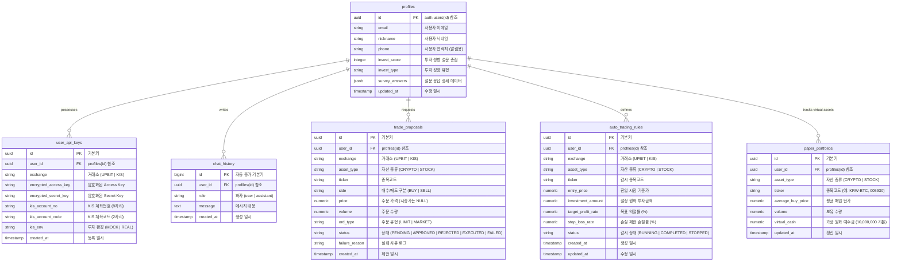

# Supabase Database 스키마 & ERD 명세서

본 문서는 **한국투자증권(KIS) 실전/모의투자** 및 **업비트(Upbit) 페이퍼 트레이딩**을 연동한 AI 트레이딩 챗봇 시스템의 Supabase 데이터베이스 물리 스키마 명세와 ERD 구조를 정리한 산출물입니다.

## 1. 데이터베이스 ERD (Mermaid)

---

## 2. 테이블 상세 설명

### 2.1 `profiles` (사용자 프로필)
* **설명**: Supabase Auth의 `auth.users` 테이블과 연동되어 서비스 내 사용자의 기본 프로필 정보를 저장하고, 사용자의 투자 성향 설문 결과를 보관합니다.
* **제약 조건 및 트리거**:
  * `id` 필드가 `auth.users.id`를 외래키로 참조하며 삭제 시 연쇄 삭제(Cascade)됩니다.
  * 사용자가 가입할 때 트리거 함수(`handle_new_user`)에 의해 `auth.users` 테이블에서 `email`, `nickname`, `phone` 정보가 자동으로 복사됩니다.

| 컬럼명 | 데이터 타입 | 제약 조건 | 설명 |
| :--- | :--- | :--- | :--- |
| `id` | `UUID` | PK, References `auth.users(id)` | 사용자 고유 ID |
| `email` | `TEXT` | - | 사용자 이메일 주소 |
| `nickname` | `TEXT` | - | 사용자 별명 |
| `phone` | `TEXT` | - | 휴대폰 번호 (자동매매 알림 발송용) |
| `invest_score` | `INT` | - | 투자 성향 설문 조사 총점 (10점~50점) |
| `invest_type` | `TEXT` | - | 판정된 투자 성향명 (`안정형` ~ `공격투자형`) |
| `survey_answers` | `JSONB` | - | 10개 문항의 개별 응답 상세 데이터 (JSON 객체) |
| `updated_at` | `TIMESTAMPTZ` | DEFAULT now(), NOT NULL | 마지막 수정 시간 |

---

### 2.2 `user_api_keys` (거래소 API 키)
* **설명**: 사용자가 등록한 거래소(한국투자증권, 업비트)의 API 인증 크리덴셜을 양방향 암호화(AES-256)하여 저장합니다.
* **제약 조건**:
  * 동일 사용자(`user_id`)가 한 거래소(`exchange`)의 모의/실전 환경(`kis_env`)당 단 하나의 레코드만 가지도록 `UNIQUE(user_id, exchange, kis_env)` 유니크 키가 걸려 있습니다.

| 컬럼명 | 데이터 타입 | 제약 조건 | 설명 |
| :--- | :--- | :--- | :--- |
| `id` | `UUID` | PK, DEFAULT gen_random_uuid() | API 키 레코드 고유 ID |
| `user_id` | `UUID` | FK, References `profiles(id)` | 소유자 고유 ID |
| `exchange` | `TEXT` | CHECK (exchange IN ('UPBIT', 'KIS')), NOT NULL | 거래소 구분 |
| `encrypted_access_key`| `TEXT` | NOT NULL | AES-256 암호화된 Access Key (AppKey) |
| `encrypted_secret_key`| `TEXT` | NOT NULL | AES-256 암호화된 Secret Key (AppSecret)|
| `kis_account_no` | `TEXT` | - | 한국투자증권 종합계좌번호 (8자리) |
| `kis_account_code` | `TEXT` | DEFAULT '01' | 종합계좌 상품코드 (2자리) |
| `kis_env` | `TEXT` | CHECK (kis_env IN ('MOCK', 'REAL')), DEFAULT 'MOCK' | 투자 환경 구분 (모의 / 실전) |
| `created_at` | `TIMESTAMPTZ` | DEFAULT now(), NOT NULL | 등록 일시 |

---

### 2.3 `paper_portfolios` (가상 투자 포트폴리오)
* **설명**: 업비트 가상 투자(시뮬레이션) 및 전체 자산 현황 조회를 위한 가상 잔고와 종목 보유 수량을 관리합니다. 
* **특이 사항**:
  * 가입 시 기본 10,000,000원(`virtual_cash`)의 모의 투자 자금을 지원하며, 매수/매도 실행 시 이 예수금과 보유 물량(`volume`)이 증감합니다.

| 컬럼명 | 데이터 타입 | 제약 조건 | 설명 |
| :--- | :--- | :--- | :--- |
| `id` | `UUID` | PK, DEFAULT gen_random_uuid() | 포트폴리오 레코드 고유 ID |
| `user_id` | `UUID` | FK, References `profiles(id)` | 소유자 고유 ID |
| `asset_type` | `TEXT` | CHECK (asset_type IN ('CRYPTO', 'STOCK')), NOT NULL | 자산 타입 구분 |
| `ticker` | `TEXT` | NOT NULL | 종목 코드 (예: KRW-BTC, 005930) |
| `average_buy_price` | `NUMERIC` | DEFAULT 0, NOT NULL | 평균 매수 단가 |
| `volume` | `NUMERIC` | DEFAULT 0, NOT NULL | 보유 수량 |
| `virtual_cash` | `NUMERIC` | DEFAULT 10000000, NOT NULL | 가상 예수금 잔고 |
| `updated_at` | `TIMESTAMPTZ` | DEFAULT now(), NOT NULL | 갱신 일시 |

---

### 2.4 `chat_history` (챗봇 대화 이력)
* **설명**: 사용자와 AI 트레이딩 챗봇 간의 자연어 대화 기록을 타임스탬프 순으로 기록합니다.

| 컬럼명 | 데이터 타입 | 제약 조건 | 설명 |
| :--- | :--- | :--- | :--- |
| `id` | `BIGINT` | PK, GENERATED BY DEFAULT AS IDENTITY | 자동 증가 대화 ID |
| `user_id` | `UUID` | FK, References `profiles(id)` | 소유자 고유 ID |
| `role` | `TEXT` | CHECK (role IN ('user', 'assistant')), NOT NULL | 발화자 역할 |
| `message` | `TEXT` | NOT NULL | 대화 메시지 본문 |
| `created_at` | `TIMESTAMPTZ` | DEFAULT now(), NOT NULL | 대화 일시 |

---

### 2.5 `trade_proposals` (매매 제안 카드)
* **설명**: AI 챗봇이 시장을 분석한 후 사용자에게 추천하는 매매 제안 기록입니다.
* **동작 원리**:
  * 이 테이블의 상태(`status`)가 `PENDING`으로 추가되면, Supabase Realtime 기능이 이를 트리거하여 프론트엔드 대시보드 챗봇 영역에 매매 승인/반대 카드를 실시간으로 렌더링합니다.

| 컬럼명 | 데이터 타입 | 제약 조건 | 설명 |
| :--- | :--- | :--- | :--- |
| `id` | `UUID` | PK, DEFAULT gen_random_uuid() | 제안 고유 ID |
| `user_id` | `UUID` | FK, References `profiles(id)` | 대상 사용자 ID |
| `exchange` | `TEXT` | CHECK (exchange IN ('UPBIT', 'KIS')), NOT NULL | 거래소 구분 |
| `asset_type` | `TEXT` | CHECK (asset_type IN ('CRYPTO', 'STOCK')), NOT NULL | 자산 유형 |
| `ticker` | `TEXT` | NOT NULL | 대상 종목 코드 |
| `side` | `TEXT` | CHECK (side IN ('BUY', 'SELL')), NOT NULL | 거래 구분 (매수 / 매도) |
| `price` | `NUMERIC` | - | 제안 단가 (시장가는 NULL) |
| `volume` | `NUMERIC` | NOT NULL | 제안 수량 |
| `ord_type` | `TEXT` | CHECK (ord_type IN ('LIMIT', 'MARKET')), NOT NULL | 주문 유형 (지정가 / 시장가) |
| `status` | `TEXT` | CHECK (status IN ('PENDING', 'APPROVED', 'REJECTED', 'EXECUTED', 'FAILED')), DEFAULT 'PENDING' | 승인 상태 흐름 |
| `failure_reason` | `TEXT` | - | 주문 실행 실패 시 에러 사유 |
| `created_at` | `TIMESTAMPTZ` | DEFAULT now(), NOT NULL | 제안 생성 시각 |

---

### 2.6 `auto_trading_rules` (조건 감시 규칙)
* **설명**: 사용자가 정의한 실시간 조건식 자동 매매 감시 규칙을 관리합니다.
* **동작 원리**:
  * 백그라운드 워커가 `RUNNING` 상태의 행을 주기적으로 감시하여, 현재 시세가 손절률(`stop_loss_rate`) 또는 익절률(`target_profit_rate`) 도달 시 자동으로 매매 주문을 실행하고 상태를 `COMPLETED`로 변경합니다.

| 컬럼명 | 데이터 타입 | 제약 조건 | 설명 |
| :--- | :--- | :--- | :--- |
| `id` | `UUID` | PK, DEFAULT gen_random_uuid() | 규칙 고유 ID |
| `user_id` | `UUID` | FK, References `profiles(id)` | 소유자 고유 ID |
| `exchange` | `TEXT` | CHECK (exchange IN ('UPBIT', 'KIS')), NOT NULL | 거래소 구분 |
| `asset_type` | `TEXT` | CHECK (asset_type IN ('CRYPTO', 'STOCK')), NOT NULL | 자산 유형 |
| `ticker` | `TEXT` | NOT NULL | 감시 대상 종목 코드 |
| `entry_price` | `NUMERIC` | NOT NULL | 규칙 진입 시점의 기준가 |
| `investment_amount`| `NUMERIC` | NOT NULL | 투자 원금 (KRW) |
| `target_profit_rate`| `NUMERIC` | NOT NULL | 익절 목표 수익률 (%) |
| `stop_loss_rate` | `NUMERIC` | NOT NULL | 손절 제한 손실률 (%) |
| `status` | `TEXT` | CHECK (status IN ('RUNNING', 'COMPLETED', 'STOPPED')), DEFAULT 'RUNNING' | 감시 활성화 상태 |
| `created_at` | `TIMESTAMPTZ` | DEFAULT now(), NOT NULL | 규칙 등록 일시 |
| `updated_at` | `TIMESTAMPTZ` | DEFAULT now(), NOT NULL | 규칙 변경 일시 |

---

## 3. 보안 정책 (Row Level Security, RLS)
모든 테이블은 데이터 보안을 강화하기 위해 **Row Level Security(RLS)**를 사용합니다.
* 사용자는 **오직 자신의 `user_id` (또는 `id`가 자신의 `auth.uid()`와 일치하는 행)**에 대한 데이터에만 접근(Select, Insert, Update, Delete)할 수 있습니다.
* 데이터베이스 단에서 완전 격리되어 멀티 테넌시 안정성을 보장합니다.
