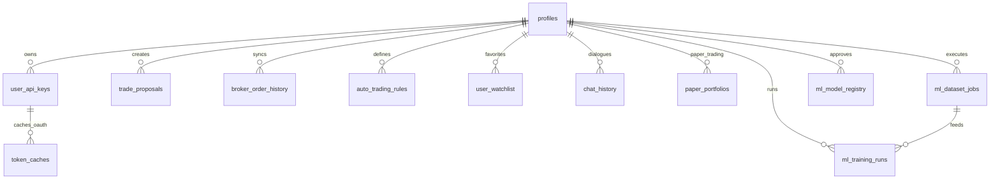

# 데이터베이스 사양서 (database_specification.md)

본 문서는 Toss증권 메인 트레이딩 MVP 시스템의 Supabase 데이터베이스 테이블 스펙 및 제약조건을 실제 마이그레이션 SQL과 백엔드 비즈니스 로직을 기준으로 상세히 정의한 표준 사양서입니다.

---

## 1. 데이터베이스 ER 다이어그램 (스키마 관계)

---

## 2. 테이블별 상세 정의 (17개 핵심 테이블)

### 2.1 profiles
*   **용도**: 서비스 가입 사용자의 기본 정보와 인증 권한의 매핑 테이블 (Supabase Auth와 auth.uid() 연동)
*   **주요 컬럼**:
    *   `id` (UUID, PK) - `auth.users.id` 참조
    *   `email` (TEXT)
    *   `nickname` (TEXT)
    *   `phone` (TEXT)
    *   `updated_at` (TIMESTAMPTZ)
*   **RLS (Row Level Security)**:
    *   `auth.uid() = id` 인 사용자만 자신의 프로필 조회 및 수정 가능.

### 2.2 user_api_keys
*   **용도**: Toss증권, KIS(한국투자증권), 코인원, 바이낸스 등 연동 거래소의 API Access/Secret Key 및 계좌 정보를 평문 노출 방지를 위해 양방향 암호화(AES-256-GCM)하여 저장합니다.
*   **주요 컬럼**:
    *   `id` (UUID, PK)
    *   `user_id` (UUID, FK) - `profiles.id` 참조
    *   `exchange` (TEXT) - `TOSS`, `COINONE`, `BINANCE`, `KIS` 등 허용. 바이낸스 USD-M 선물도 별도 키 레코드를 만들지 않고 `BINANCE` 키를 재사용합니다.
    *   `broker_env` (TEXT) - `MOCK`(모의투자), `REAL`(실거래)
    *   `encrypted_access_key` (TEXT) - 암호화된 API Key / Client ID
    *   `encrypted_secret_key` (TEXT) - 암호화된 Secret Key / Client Secret
    *   `toss_account_seq` (TEXT) - Toss증권 계좌 고유 시퀀스
    *   `toss_account_no` (TEXT) - Toss증권 계좌번호
    *   `kis_account_no` (TEXT) - KIS 종합계좌번호 (8자리)
    *   `kis_account_code` (TEXT) - KIS 상품코드 (2자리, 기본 '01')
    *   `created_at` (TIMESTAMPTZ)
*   **제약조건**:
    *   `UNIQUE (user_id, exchange, broker_env)` 복합 유니크 키 적용
*   **RLS**:
    *   `auth.uid() = user_id` 조건으로 본인의 API 키 레코드만 관리 가능.

### 2.3 trade_proposals
*   **용도**: LLM 챗봇이 생성하여 제안하는 매매 제안 기록 및 사용자가 최종 승인하여 실행한 실거래/모의 주문 결과 로깅 테이블.
*   **주요 컬럼**:
    *   `id` (UUID, PK)
    *   `user_id` (UUID, FK) - `profiles.id` 참조
    *   `exchange` (TEXT) - `TOSS`, `COINONE`, `BINANCE`, `BINANCE_UM_FUTURES`, `KIS` 등. `BINANCE_UM_FUTURES`는 주문/이력 식별값이며 인증 키는 `user_api_keys.exchange=BINANCE`를 사용합니다.
    *   `asset_type` (TEXT) - `STOCK`(주식), `CRYPTO`(가상자산)
    *   `symbol` (TEXT) - 종목 코드 (예: 6자리 코드 또는 코인 식별명)
    *   `ticker` (TEXT) - KIS/Toss용 티커
    *   `side` (TEXT) - `BUY`(매수), `SELL`(매도)
    *   `price` (NUMERIC) - 지정가 주문 단가
    *   `volume` (NUMERIC) - 주문 수량
    *   `order_amount` (NUMERIC) - Toss 금액 주문용 원화 금액
    *   `ord_type` (TEXT) - `LIMIT`(지정가), `MARKET`(시장가)
    *   `status` (TEXT) - `PENDING`(대기), `APPROVED`(승인), `REJECTED`(반려), `EXECUTED`(체결완료), `FAILED`(실패)
    *   `failure_reason` (TEXT) - 외부 거래소 에러 코드 및 오류 내용
    *   `client_order_id` (UUID) - 멱등성 보장용 클라이언트 고유 주문 ID
    *   `external_order_id` (TEXT) - 거래소 체결 주문번호
    *   `raw_order_payload` (JSONB) - 거래소에서 반환한 응답 JSON 전문
    *   `broker_env` (TEXT) - `MOCK`(모의), `REAL`(실거래)
    *   `created_at` (TIMESTAMPTZ)
    *   `modified_at` (TIMESTAMPTZ) - 주문 정정 시점
    *   `canceled_at` (TIMESTAMPTZ) - 주문 취소 시점
*   **RLS & Realtime**:
    *   Supabase Realtime 구독이 활성화되어 있어 백엔드 생성 즉시 프론트엔드로 승인 팝업 노출.
    *   `auth.uid() = user_id` 사용자만 읽기 및 관리 가능.
*   **현재 구현 메모**:
    *   `COINONE` 실주문은 백엔드 `trade` 라우트에서 지정가(`LIMIT`) 매수/매도와 미체결 주문 취소까지 연결되어 있습니다.
    *   `COINONE` 시장가(`MARKET`) 주문은 API 정책 검증 전까지 프론트엔드와 백엔드에서 차단합니다.
    *   `BINANCE` 현물 주문은 `REAL`과 `MOCK` 환경을 분리해 지원합니다. `MOCK`은 Binance Spot Demo API를 사용하며 실제 입출금성 API는 호출하지 않습니다.
    *   `BINANCE_UM_FUTURES`는 USD-M 선물 계좌/포지션 조회와 `MOCK` 주문을 지원합니다. 인증 키는 `BINANCE` 레코드를 재사용하며, 주문 전 레버리지(`1~125x`)와 마진 타입(`CROSSED`/`ISOLATED`)을 심볼 단위로 설정한 뒤 주문을 전송합니다. `REAL` 선물 주문은 `BINANCE_FUTURES_REAL_ENABLED=true` 환경변수 없이는 백엔드에서 차단합니다.

### 2.4 auto_trading_rules
*   **용도**: 사용자가 자연어로 설정하거나 명시적으로 승인한 감시 조건식(익절 %, 손절 % 등)을 보관하는 테이블.
*   **주요 컬럼**:
    *   `id` (UUID, PK)
    *   `user_id` (UUID, FK) - `profiles.id` 참조
    *   `exchange` (TEXT)
    *   `broker_env` (TEXT) - `MOCK`, `REAL`
    *   `asset_type` (TEXT) - `STOCK` / `CRYPTO`
    *   `symbol` (TEXT)
    *   `ticker` (TEXT)
    *   `entry_price` (NUMERIC) - 진입 가격 (기본 평단가)
    *   `investment_amount` (NUMERIC) - 할당 투자 금액
    *   `quantity` (NUMERIC) - 조건 도달 시 매도할 수량. 없으면 `investment_amount / entry_price`로 보정
    *   `target_profit_rate` (NUMERIC) - 익절 비율 백분율 (%)
    *   `stop_loss_rate` (NUMERIC) - 손절 비율 백분율 (%)
    *   `execution_mode` (TEXT) - `PROPOSAL`(매도 제안만 생성), `AUTO`(조건 도달 시 자동 매도 주문 전송)
    *   `trigger_side` (TEXT) - `TAKE_PROFIT`, `STOP_LOSS`
    *   `trigger_price` (NUMERIC) - 조건 도달 시 확인된 현재가
    *   `triggered_at` (TIMESTAMPTZ) - 조건 도달 시각
    *   `last_checked_at` (TIMESTAMPTZ) - 워커의 마지막 감시 확인 시각
    *   `last_error` (TEXT) - 최근 감시/주문 실패 사유
    *   `exit_order_proposal_id` (UUID) - 조건 도달 후 생성된 `trade_proposals.id`
    *   `exit_order_payload` (JSONB) - 자동매도 주문 응답 또는 제안 생성 메타데이터
    *   `status` (TEXT) - `RUNNING`(감시 중), `COMPLETED`(익손절 완료), `STOPPED`(정지)
    *   `created_at` (TIMESTAMPTZ)
    *   `updated_at` (TIMESTAMPTZ)
*   **RLS**:
    *   `auth.uid() = user_id` 기반 RLS 적용.
*   **실행 정책**:
    *   `backend/services/auto_trading_rule_engine.py`가 `RUNNING` 규칙을 조회해 현재가가 익절/손절 가격에 도달했는지 확인합니다.
    *   `execution_mode=PROPOSAL`이면 `trade_proposals`에 `PENDING` 매도 제안만 생성합니다.
    *   `execution_mode=AUTO`이면 워커가 매도 주문을 직접 전송하고 `trade_proposals`에 결과를 기록합니다. 단, 실거래(`REAL`) 주문 추정 원화 금액이 내부 1회 한도 10만 원을 초과하면 자동 주문 대신 제안 생성으로 우회합니다.

### 2.4.1 broker_order_history
*   **용도**: 외부 브로커(Toss/KIS/Coinone/Binance)의 실제 주문 원장을 주기적으로 동기화해 저장하는 테이블입니다. 앱 내부 제안 흐름(`trade_proposals`)과 분리하여 실제 미체결/부분체결/체결/취소 결과를 추적합니다.
*   **주요 컬럼**:
    *   `id` (UUID, PK)
    *   `user_id` (UUID, FK) - `profiles.id` 참조
    *   `exchange` (TEXT) - `TOSS`, `KIS`, `COINONE`, `BINANCE`, `BINANCE_UM_FUTURES`
    *   `broker_env` (TEXT) - `MOCK`, `REAL`
    *   `account_ref` (TEXT) - 브로커 계좌 식별값
    *   `external_order_id` (TEXT) - 거래소 원주문번호
    *   `client_order_id` (TEXT) - 클라이언트 멱등 주문번호
    *   `symbol` (TEXT) - 종목 코드/티커
    *   `market_country` (TEXT) - `KR` / `US`
    *   `side` (TEXT) - `BUY` / `SELL`
    *   `order_type` (TEXT)
    *   `time_in_force` (TEXT)
    *   `status` (TEXT) - 내부 정규화 상태값 (`OPEN`, `PARTIALLY_FILLED`, `EXECUTED`, `CANCELED`, `FAILED` 등)
    *   `raw_status` (TEXT) - 거래소 원본 상태값
    *   `currency` (TEXT) - `KRW` / `USD`
    *   `price` (NUMERIC)
    *   `quantity` (NUMERIC)
    *   `order_amount` (NUMERIC)
    *   `filled_quantity` (NUMERIC)
    *   `average_filled_price` (NUMERIC)
    *   `filled_amount` (NUMERIC)
    *   `commission` (NUMERIC)
    *   `tax` (NUMERIC)
    *   `ordered_at` (TIMESTAMPTZ)
    *   `filled_at` (TIMESTAMPTZ)
    *   `canceled_at` (TIMESTAMPTZ)
    *   `settlement_date` (DATE)
    *   `source_api` (TEXT)
    *   `raw_payload` (JSONB)
    *   `last_synced_at` (TIMESTAMPTZ)
    *   `created_at` (TIMESTAMPTZ)
    *   `updated_at` (TIMESTAMPTZ)
*   **제약조건**:
    *   `UNIQUE (user_id, exchange, broker_env, external_order_id)` 복합 유니크 키 적용
*   **RLS & Realtime**:
    *   `auth.uid() = user_id` 조건으로 사용자별 원장만 조회/관리 가능
    *   Supabase Realtime publication에 포함되어 거래내역 탭에서 즉시 반영 가능

### 2.4.2 asset_transfer_proposals
*   **용도**: 코인원에서 바이낸스로 이동하는 가상자산 출금 요청의 사전검증, 사용자 승인, 외부 거래소 응답, 바이낸스 입금 확인 상태를 추적합니다.
*   **주요 컬럼**:
    *   `id` (UUID, PK)
    *   `user_id` (UUID, FK) - `profiles.id` 참조
    *   `from_exchange` (TEXT) - 현재 `COINONE`
    *   `to_exchange` (TEXT) - 현재 `BINANCE`
    *   `currency` (TEXT) - 출금 코인 심볼
    *   `network` (TEXT) - 바이낸스 입금 네트워크
    *   `amount` (NUMERIC) - 출금 수량
    *   `address` (TEXT) - 바이낸스 입금 주소
    *   `secondary_address` (TEXT) - XRP/XLM/EOS Destination Tag 또는 Memo
    *   `status` (TEXT) - `PENDING`, `APPROVED`, `SUBMITTED`, `COMPLETED`, `FAILED`, `NEEDS_REVIEW` 등
    *   `external_transaction_id` (TEXT) - 코인원 출금 거래 식별 ID
    *   `raw_request` / `precheck_payload` / `raw_response` / `binance_deposit_payload` (JSONB)
    *   `failure_reason` (TEXT)
    *   `approved_at`, `submitted_at`, `completed_at`, `created_at`, `updated_at` (TIMESTAMPTZ)
*   **RLS & Realtime**:
    *   `auth.uid() = user_id` 조건으로 사용자별 출금 요청만 조회/관리 가능
    *   Supabase Realtime publication에 포함되어 상태 추적 UI에 즉시 반영 가능
*   **현재 구현 메모**:
    *   실제 출금 API는 `/api/transfer/withdraw/approve`에서만 호출됩니다.
    *   승인 단계에서 바이낸스 API 조회 입금 주소 및 Tag와 입력값이 다르면 출금을 차단합니다.

### 2.5 news_articles
*   **용도**: 실시간 수집된 뉴스 및 종목 키워드, 그리고 AI 요약(Sentiment, Summary) 정보를 적재하여 RAG 챗봇 및 종목 상세 뉴스에 데이터를 급지함.
*   **주요 컬럼**:
    *   `id` (UUID, PK)
    *   `market` (TEXT) - `KR` / `US`
    *   `source` (TEXT) - `NAVER`, `FINNHUB` 등
    *   `source_article_id` (TEXT)
    *   `title` (TEXT) - 뉴스 제목
    *   `summary` (TEXT) - 본문 요약문
    *   `url` (TEXT) - 원본 URL
    *   `published_at` (TIMESTAMPTZ) - 뉴스 발행 시각
    *   `fetched_at` (TIMESTAMPTZ) - 크롤러 수집 시각
    *   `symbol` (TEXT) - 연관 주식 종목코드
    *   `sentiment` (TEXT) - 감성 분석 결과 (`positive`, `negative`, `neutral`)
    *   `content_hash` (TEXT) - 중복 기사 적재 방지용 해시
    *   `ai_summary` (TEXT) - AI RAG용 정교한 기사 요약본
    *   `ai_summary_model` (TEXT)
    *   `ai_summary_generated_at` (TIMESTAMPTZ)
*   **RLS**:
    *   조회는 인증된 모든 사용자(`authenticated`) 가능.

### 2.6 news_fetch_logs
*   **용도**: 뉴스 수집 봇의 동작 상태 및 배치 결과를 기록하는 로깅 테이블.
*   **주요 컬럼**:
    *   `id` (UUID, PK)
    *   `source` (TEXT)
    *   `query_key` (TEXT) - 검색 키워드 또는 종목 코드
    *   `status` (TEXT) - `success` / `failed`
    *   `request_count` (INTEGER)
    *   `fetched_count` (INTEGER)
    *   `started_at` (TIMESTAMPTZ)
    *   `error_message` (TEXT)

### 2.6.1 dart_corp_codes
*   **용도**: OpenDART 고유번호(`corp_code`)와 국내 주식 종목코드(`stock_code`)를 매핑하는 상장사 사전 테이블입니다.
*   **주요 컬럼**:
    *   `corp_code` (TEXT, PK) - DART 기업 고유번호
    *   `corp_name` (TEXT) - 기업명
    *   `stock_code` (TEXT, UNIQUE) - 국내 주식 6자리 종목코드
    *   `modify_date` (DATE) - DART 사전 수정일
    *   `raw_payload` (JSONB) - 원본 사전 데이터
*   **RLS**:
    *   일반 조회는 허용하고, 생성/수정은 `service_role`만 수행합니다.

### 2.6.2 dart_disclosures
*   **용도**: OpenDART 전체 공시 목록 API에서 `stock_code`가 있는 상장사 공시만 수집해 저장하는 공시 캐시 테이블입니다.
*   **주요 컬럼**:
    *   `rcept_no` (TEXT, UNIQUE) - 공시 접수번호, 중복 upsert 기준
    *   `corp_code` (TEXT) - DART 기업 고유번호
    *   `stock_code` (TEXT) - 국내 주식 종목코드
    *   `corp_name` (TEXT) - 기업명
    *   `report_nm` (TEXT) - 공시명
    *   `flr_nm` (TEXT) - 제출인
    *   `rcept_dt` (DATE) - 접수일
    *   `url` (TEXT) - DART 원문 URL
    *   `summary` (TEXT) - 목록 기반 간단 요약
    *   `raw_payload` (JSONB) - OpenDART 원본 응답
*   **RLS**:
    *   활성 공시는 공개 조회 가능하고, 수집/수정은 `service_role`만 수행합니다.

### 2.6.3 dart_fetch_logs
*   **용도**: OpenDART 전체 공시 목록 수집 및 최근 1년 백필 작업의 실행 결과를 기록합니다.
*   **주요 컬럼**:
    *   `query_key` (TEXT) - `incremental` 또는 백필 날짜 구간
    *   `status` (TEXT) - `SUCCESS`, `FAILED`, `SKIPPED`
    *   `fetched_count` (INTEGER)
    *   `inserted_count` (INTEGER)
    *   `request_count` (INTEGER)
    *   `error_message` (TEXT)

### 2.7 user_watchlist
*   **용도**: 사용자가 개별적으로 "하트"를 눌러 즐겨찾기 목록에 등록한 관심 종목 보관 테이블.
*   **주요 컬럼**:
    *   `id` (UUID, PK)
    *   `user_id` (UUID, FK) - `profiles.id` 참조
    *   `symbol` (TEXT) - 관심 종목 코드
    *   `name` (TEXT) - 종목 한글 표시명
    *   `exchange` (TEXT) - `TOSS`, `COINONE`, `BINANCE`, `BINANCE_UM_FUTURES`, `KIS` 등. 바이낸스 선물 주문 이력은 `BINANCE_UM_FUTURES`로 남기되 키 저장은 `BINANCE`를 사용합니다.
    *   `asset_type` (TEXT) - `STOCK` 또는 `CRYPTO`
    *   `latest_price` (NUMERIC) - 최종 조회 시세 캐시
    *   `change_rate` (NUMERIC) - 당일 변동률
    *   `created_at` (TIMESTAMPTZ)
    *   `updated_at` (TIMESTAMPTZ)
*   **제약조건**:
    *   `UNIQUE (user_id, symbol, asset_type, exchange)` 적용으로 중복 등록 방지.
*   **RLS**:
    *   `auth.uid() = user_id` 조건으로 사용자 단위로 안전하게 격리되어 조회/추가/수정/삭제 가능.

### 2.8 token_caches
*   **용도**: Toss 및 KIS Open API 호출 시 사용하는 OAuth 2.0 Access Token 및 만료 기한의 공유 캐시 저장소.
*   **주요 컬럼**:
    *   `id` (UUID, PK)
    *   `user_id` (UUID) - 토큰 발급 소유 계정 ID (사용자 격리 지원)
    *   `exchange` (TEXT) - `TOSS`, `KIS` 등
    *   `broker_env` (TEXT) - `MOCK`, `REAL`
    *   `encrypted_token` (TEXT) - 암호화된 OAuth 토큰 문자열
    *   `expires_at` (TIMESTAMPTZ) - 토큰 만료 만기 시각
    *   `updated_at` (TIMESTAMPTZ)
*   **RLS**:
    *   `auth.uid() = user_id` 조건으로 본인의 토큰 정보에만 접근 가능.

### 2.9 active_locks
*   **용도**: 백그라운드 스레드 및 워커가 기동될 때 크론(뉴스 크롤러, ML 자동화 등)의 동시성 이중 구동을 막기 위한 PostgreSQL 분산 뮤텍스 락 테이블.
*   **주요 컬럼**:
    *   `key` (TEXT, PK) - 락 명칭 (예: `news_ingest`, `ml_automation`)
    *   `owner` (TEXT) - 락을 소유한 프로세스/스레드 정보
    *   `expires_at` (TIMESTAMPTZ) - 락 자동 릴리즈 시간
    *   `created_at` (TIMESTAMPTZ)

### 2.10 ml_dataset_jobs
*   **용도**: 머신러닝 학습 데이터를 추출하는 백그라운드 데이터 수집 작업 로그 정보.
*   **주요 컬럼**:
    *   `id` (UUID, PK)
    *   `user_id` (UUID, FK) - `profiles.id` 참조
    *   `asset_type` (TEXT) - `STOCK` / `CRYPTO`
    *   `exchange` (TEXT)
    *   `status` (TEXT) - `running`, `success`, `failed`
    *   `symbols` (JSONB) - 수집 종목 배열
    *   `row_count` (INTEGER)
    *   `output_path` (TEXT) - 데이터셋 저장 파일 경로

### 2.11 ml_training_runs
*   **용도**: LightGBM 알고리즘 모델의 로컬 사전 학습 실행 세부 통계 지표와 평가(Metrics) 로깅 테이블.
*   **주요 컬럼**:
    *   `id` (UUID, PK)
    *   `user_id` (UUID, FK) - `profiles.id` 참조
    *   `model_version` (TEXT)
    *   `status` (TEXT) - `running`, `success`, `failed`
    *   `metrics_json` (JSONB) - 백테스트 수익률, MDD, CV Accuracy 등 평가지표

### 2.12 ml_model_registry
*   **용도**: 학습이 끝난 모델 파일의 메타데이터를 저장하고, 실제 추론에 기동되는 서빙(`Serving`) 모델을 승격 및 통제하기 위한 레지스트리.
*   **주요 컬럼**:
    *   `id` (UUID, PK)
    *   `asset_type` (TEXT)
    *   `model_version` (TEXT)
    *   `is_serving` (BOOLEAN) - 실시간 시세 예측 서빙 기동 여부
    *   `is_recommended` (BOOLEAN)
    *   `approved_by` (UUID) - 최종 승인 시니어 개발자 ID

### 2.13 kis_stock_master (종목 마스터 원천 DB)
*   **용도**: 국내 및 미국 상장 주식의 원천 정보 데이터베이스. 백엔드의 종목코드 자동완성 및 한글 종목명-종목코드 동적 치환 검색용 단일 원천(Single Source of Truth)으로 동작합니다.
*   **주요 컬럼**:
    *   `id` (UUID, PK)
    *   `symbol` (TEXT) - 종목 고유 코드 (국내는 6자리 예: `005930`, 미국은 티커 예: `AAPL`)
    *   `name` (TEXT) - 공식 종목명
    *   `display_name` (TEXT) - 접두사(`KR...`)와 공백을 깔끔하게 제거해 사용자가 읽을 수 있도록 정제한 표시명 (예: `이노스페이스`, `삼성전자`)
    *   `sector` (TEXT) - 주식 테마 분류 (예: `반도체`, `우주항공`, `빅테크`)
    *   `market_segment` (TEXT) - `KOSPI`, `KOSDAQ`, `KONEX`, `ETF`, `ETN`, `NASDAQ`, `NYSE`, `AMEX`, `OTHER` 허용
    *   `market_country` (TEXT) - `KR` (대한민국) / `US` (미국)
    *   `asset_type` (TEXT) - `STOCK` 고정
    *   `source` (TEXT) - `KIS` / `TOSS`
    *   `source_file_row` (JSONB) - 마스터 파일 파싱 정보 보관용
    *   `is_active` (BOOLEAN) - 거래 활성화 여부
    *   `created_at` (TIMESTAMPTZ)
    *   `updated_at` (TIMESTAMPTZ)
*   **제약조건**:
    *   `symbol` UNIQUE 제약 적용.
    *   `market_country IN ('KR', 'US')` 적용 (미국주식 완벽 대응).
    *   `market_segment IN ('KOSPI', 'KOSDAQ', 'KONEX', 'ETF', 'ETN', 'NASDAQ', 'NYSE', 'AMEX', 'OTHER')` 적용.
*   **RLS**:
    *   일반 사용자는 조회(SELECT)만 가능, 생성/수정/삭제 권한은 `service_role` 전용.

### 2.14 kis_stock_turnover_latest
*   **용도**: KIS 거래대금 및 시가총액 정보의 캐시를 저장하는 실시간 통계 테이블. 대시보드의 실시간 랭킹(거래량/상승률 등) 위젯에 사용됩니다.
*   **주요 컬럼**:
    *   `id` (UUID, PK)
    *   `symbol` (TEXT, UNIQUE) - 종목 코드
    *   `name` (TEXT)
    *   `market_segment` (TEXT)
    *   `market_country` (TEXT)
    *   `current_price` (NUMERIC) - 당일 현재가
    *   `change_rate` (NUMERIC) - 당일 대비 상승률 (%)
    *   `trading_volume` (NUMERIC) - 당일 거래량
    *   `trading_value` (NUMERIC) - 당일 거래대금
    *   `as_of` (TIMESTAMPTZ) - KIS 최종 동기화 시점
*   **RLS**:
    *   조회(SELECT)는 누구나 가능, 갱신(UPSERT)은 `service_role` 계정 전용.

---

### 2.15 paper_portfolios
*   **용도**: 모의투자(`MOCK` 환경) 모드 시 사용자의 모의 예수금 및 모의 매매 평단가/수량을 보관하여 가상 자산을 연산해 주는 테이블.
*   **주요 컬럼**:
    *   `id` (UUID, PK)
    *   `user_id` (UUID, FK) - `profiles.id` 참조
    *   `asset_type` (TEXT) - `CRYPTO` / `STOCK`
    *   `ticker` (TEXT) - 종목 티커/심볼
    *   `average_buy_price` (NUMERIC) - 모의 평단가
    *   `volume` (NUMERIC) - 모의 보유수량
    *   `virtual_cash` (NUMERIC) - 가상 원화 잔고 (기본 10,000,000원 제공)
    *   `updated_at` (TIMESTAMPTZ)
*   **제약조건**:
    *   `UNIQUE (user_id, asset_type, ticker)` 복합 제약조건 적용.
*   **RLS**:
    *   `auth.uid() = user_id` 인 사용자만 자신의 모의 잔고 조회 및 관리 가능.

### 2.16 chat_history
*   **용도**: 사용자와 트레이딩 챗봇(AI 비서) 간의 대화 이력을 데이터베이스에 저장하여, 페이지 새로고침 시에도 이전 대화 맥락을 즉시 로드해 복구하기 위한 테이블.
*   **주요 컬럼**:
    *   `id` (BIGINT, PK, Identity)
    *   `user_id` (UUID, FK) - `profiles.id` 참조
    *   `role` (TEXT) - `user`(사용자 입력) / `assistant`(AI 답변)
    *   `message` (TEXT) - 메시지 대화 본문
    *   `created_at` (TIMESTAMPTZ)
*   **RLS**:
    *   `auth.uid() = user_id` 조건으로 자신의 챗 로그에만 보안 격리 적용.
