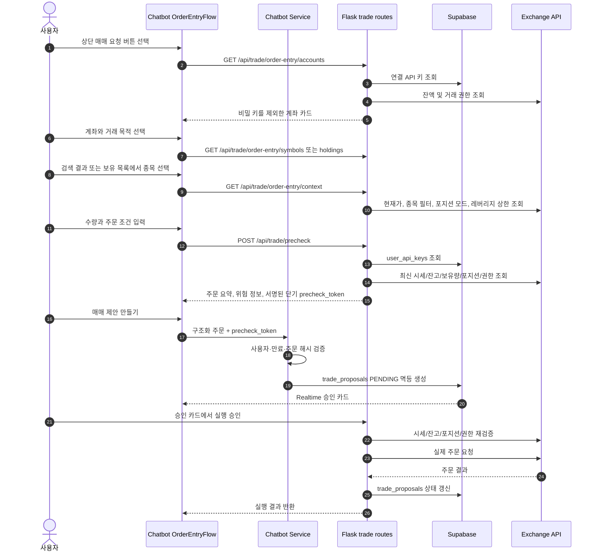
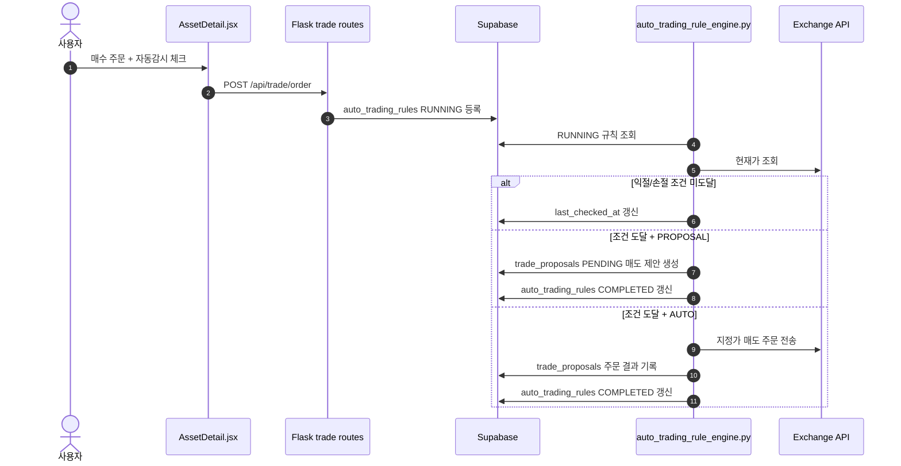
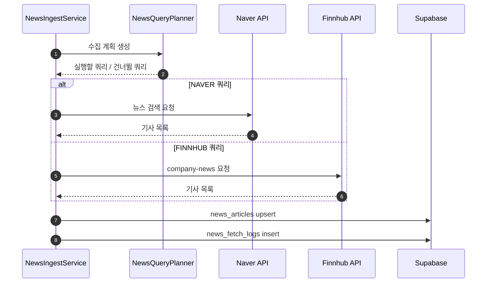
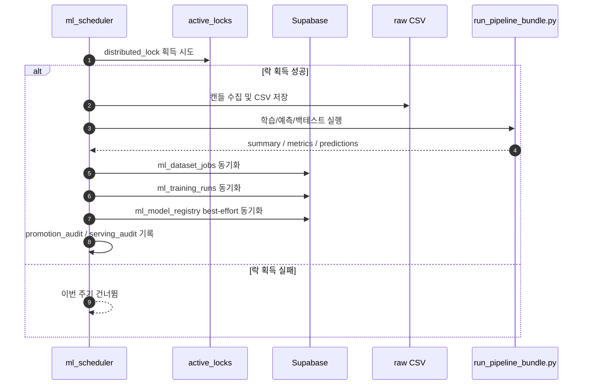
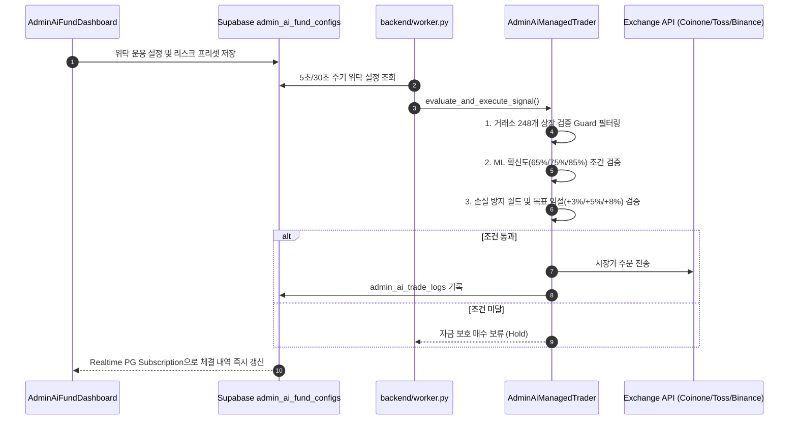

# 시스템 흐름 문서

본 문서는 현재 코드 기준의 실제 시스템 흐름을 정리합니다.
특히 `app.py`와 `worker.py`의 역할 분리, `active_locks` 분산 락, `token_caches` 토큰 캐시, `NAVER/FINNHUB` 뉴스 수집, DART 공시 수집, 조건감시 자동/반자동 매도 흐름을 기준으로 작성했습니다.

## 1. 전체 아키텍처

```mermaid
graph TD
    subgraph Frontend ["React + Vite Frontend"]
        Dashboard["Dashboard / AssetDetail / AdminMlData"]
        SBClient["Supabase Client"]
    end

    subgraph Gateway ["Flask API Gateway"]
        App["backend/app.py"]
        Routes["home / keys / ml / news / disclosures / trade / transfer"]
    end

    subgraph Worker ["Background Worker"]
        WorkerMain["backend/worker.py"]
        MLScheduler["ml_scheduler.py"]
        MarketScheduler["market_snapshot_scheduler.py"]
        AutoExitScheduler["auto_trading_rule_engine.py"]
    end

    subgraph Supabase ["Supabase"]
        DB[(Postgres)]
        UserKeys["user_api_keys"]
        TokenCaches["token_caches"]
        Locks["active_locks"]
        NewsArticles["news_articles"]
        Registry["ml_model_registry"]
        AutoRules["auto_trading_rules"]
        TradeProposals["trade_proposals"]
    end

    subgraph External ["External APIs"]
        Toss["Toss"]
        KIS["KIS"]
        Coinone["Coinone"]
        Binance["Binance"]
        Naver["Naver News"]
        Finnhub["Finnhub"]
    end

    Dashboard -->|REST| App
    Dashboard -->|Auth / 일부 직접 조회| SBClient
    App --> Routes
    Routes --> DB
    Routes --> Toss
    Routes --> KIS
    Routes --> Coinone
    Routes --> Binance

    WorkerMain --> MLScheduler
    WorkerMain --> MarketScheduler
    WorkerMain --> AutoExitScheduler

    MLScheduler --> Locks
    MLScheduler --> TokenCaches
    MLScheduler --> Registry
    MLScheduler --> Toss
    MLScheduler --> Binance

    MarketScheduler --> KIS

    AutoExitScheduler --> Locks
    AutoExitScheduler --> AutoRules
    AutoExitScheduler --> UserKeys
    AutoExitScheduler --> TradeProposals
    AutoExitScheduler --> Toss
    AutoExitScheduler --> KIS
    AutoExitScheduler --> Coinone
    AutoExitScheduler --> Binance

    Routes --> NewsArticles
    MLScheduler --> NewsArticles
    MLScheduler --> Naver
    MLScheduler --> Finnhub
```

## 2. API Gateway와 Worker의 역할 분리

### `backend/app.py`

- Flask 앱 생성 및 Blueprint 등록
- CORS 허용
- `CryptoHelper`, `NewsRepository`, `NewsIngestService` 등 공용 서비스 인스턴스 바인딩
- 환경 변수에 따라 일부 스케줄러를 gateway 내부에서 기동 가능

현재 기본 동작에서 중요한 점:

- `SCHEDULER_RUN_IN_GATEWAY=false`가 기본값입니다.
- 따라서 뉴스 수집, ML 자동화, 홈 마켓 스냅샷은 기본적으로 `worker.py`를 별도 실행하는 구조가 기준입니다.

### `backend/worker.py`

현재 worker는 다음 스케줄러를 모두 등록합니다.

1. 뉴스 수집 스케줄러
2. DART 공시 수집 스케줄러
3. ML 자동화 스케줄러
4. 홈 마켓 스냅샷 스케줄러
5. 조건감시 자동/반자동 매도 스케줄러
6. 전체 사용자 미완료 주문 상태 동기화 스케줄러

미완료 주문 상태 동기화는 `OPEN_ORDER_STATUS_SYNC_ENABLED=true`일 때만 작동합니다. 대상은 `APPROVED`, `ORDERED`, `OPEN`, `PARTIALLY_FILLED`, `MODIFIED` 상태의 `trade_proposals`이며, KIS/코인원/바이낸스/바이낸스 선물 API에서 실제 상태를 조회해 `EXECUTED`, `CANCELED`, `FAILED`, `PARTIALLY_FILLED`, `ORDERED`로 보정합니다.

운영 문서에서는 "스케줄러는 app.py에서 항상 돈다"라고 적으면 사실과 다릅니다.

## 3. 상단 단일 진입 매매 요청과 승인 흐름

현재 구현 기준 사실:

- 일반 채팅의 자연어 주문 요청은 종목·수량·가격을 추출하거나 폼을 열지 않고 상단 `매매 요청` 안내만 반환합니다.
- 매도와 선물 청산은 서버가 조회한 보유 종목·포지션 목록에서만 선택합니다.
- `POST /api/trade/precheck`는 제안을 생성하지 않으며 입력값이 바뀌면 프론트의 기존 토큰을 즉시 폐기합니다.
- 바이낸스 USD-M 선물은 One-way/Hedge 모드를 조회해 신규 롱·숏·롱 청산·숏 청산 필드를 서버에서 변환합니다.
- 승인 시 제안에 저장된 서버 검증 필드로 최신 공통 사전검증을 다시 실행하고, 상태 변화가 있으면 외부 주문 전에 차단합니다.

### 조건감시 자동/반자동 매도 흐름

현재 구현 기준 사실:

- `execution_mode=PROPOSAL`은 조건 도달 시 매도 제안만 생성합니다.
- `execution_mode=AUTO`는 조건 도달 시 워커가 매도 주문을 직접 전송합니다.
- Binance USD-M 선물은 롱 포지션 청산 방향(`BOTH + reduceOnly SELL`)만 자동매도 흐름에 맞습니다. 숏 청산은 매수 청산이므로 별도 정책으로 분리해야 합니다.

## 4. 뉴스 수집 흐름

현재 코드 기준 뉴스 공급원은 `NAVER`와 `FINNHUB`입니다.

현재 구현 특징:

- `watchlist_symbols`에서 일부 종목을 동적으로 가져와 뉴스 쿼리에 반영할 수 있습니다.
- `news_articles`에는 원문 요약과 AI 요약(`ai_summary`)이 함께 저장됩니다.
- `POST /api/news/summaries/ensure`로 누락된 요약을 보강할 수 있습니다.

## 5. ML 자동화 흐름

현재 코드 기준 사실:

- 자동화 preset 정의 파일은 `backend/services/ml_automation_service.py`입니다.
- 현재 운영 점검 기준 preset은 `stock-v11-full`, `crypto-v10-full` (248개 코인 30m 캔들), `kr-stock-v1-full`, `us-stock-v1-full`입니다.
- 통합 주식 모델(v11), 국내주식 모델(v1), 해외주식 모델(v1), 코인 모델(v10)은 `model_registry.json` 및 Supabase `ml_model_registry`를 통해 serving/recommended/latest 상태를 관리합니다.
- 코인 v10 모델은 248개 알트코인 30분봉 데이터(11.5만 건)로 학습되며, Optuna HPO(5-fold time series CV)로 최적화된 hyper-parameters(CV ROC AUC 0.5942, Risk ROC AUC 0.6062)를 사용합니다.
- Promotion Guard 검증 시 248개 코인 노이즈 특성을 반영하여 `min_cv_roc_auc: 0.50`, `min_precision_at_top_10pct: 0.20` 임계값을 적용하고, 학습 완수 시 `lgbm_crypto_signal_v10`을 자동 서빙 모델로 승격 조치합니다.
- `ml/data/ops/job_history.json`이 1차 작업 이력 저장소입니다.
- Supabase의 `ml_dataset_jobs`, `ml_training_runs`, `ml_model_registry`는 동기화 대상이지만, 테이블 부재 시에도 흐름이 계속 진행되도록 작성되어 있습니다.
- EC2 배포 시에는 `ml/src/export_serving_package.py`로 생성한 서빙 패키지 `.tar.gz`만 업로드하며, raw 학습 데이터와 전체 processed 산출물은 배포 대상에서 제외합니다.

## 6. 토큰 캐시 흐름

현재 Toss/KIS OAuth 토큰은 로컬 파일보다 Supabase `token_caches`를 우선 사용하는 구조입니다.

### 로컬 ML 릴리스와 AWS 주문 분리

AI 위탁의 모델 학습·예측·릴리스 배포는 로컬 ML 런처가 담당하고, AWS `backend-worker`는 주문·보호 매도·대사만 담당합니다. AWS 신규 매수는 `ML_RELEASE_REQUIRED=true`일 때 검증된 현재 릴리스와 코인 원본 데이터 시각(`prediction_data_at`, 90분 이내)을 모두 만족해야 합니다. `AI_FUND_EXECUTION_ENABLED=true`는 AWS 실행 노드에만 설정하며, `AI_FUND_TRADING_ENABLED`가 별도로 true여야 주문 스케줄러가 시작됩니다.

1. API 호출 전 `token_cache_service` 조회
2. 유효 토큰이 있으면 복호화해서 사용
3. 없거나 만료되었으면 거래소에서 재발급
4. 새 토큰을 암호화해서 `token_caches`에 upsert

문서상 주의:

- 저장소에 `.toss_token_cache.json`, `.kis_token_cache.json` 파일이 남아 있어도, 현재 운영 설명에서는 이것을 기준 토큰 저장소처럼 적지 않는 편이 맞습니다.

## 7. 분산 락 흐름

현재 `backend/services/lock_service.py`는 Supabase `active_locks` 테이블 기반 분산 락을 사용합니다.

- 뉴스 수집: `news_ingest`
- DART 공시 수집: `dart_ingest`
- 코인 자동화: `crypto_automation`
- 주식 자동화: 코드 내부 주기별 락 키 사용
- 조건감시 자동/반자동 매도: `auto_trading_rules`

락 획득 실패 시 예외로 중단하기보다, 해당 주기의 작업을 건너뛰고 다음 사이클을 기다리는 방식입니다.

## 8. 관리자 AI 위탁 자동투자 및 리스크 관리 시스템

현재 구현 사양:

- **실행 아키텍처**: REST API 게이트웨이(`app.py`)와 완전히 분리된 백그라운드 프로세스(`backend/worker.py`) 내 `AdminAiManagedTrader` 및 `start_auto_trading_rule_scheduler()`에서 상주 구동됩니다.
- **상장 상태 검증 Guard**: 선택한 거래소(예: 코인원 248개 종목)에 실제로 상장되어 거래 가능한 종목만 strict filter를 거쳐 주문을 집행합니다.
- **리스크 정책 프리셋**:
  - **보수적**: 목표익절 **+3.0%** / 손절 **-1.0%** / 최소 확신도 **85%** / 1회 투입 **5%**
  - **중립적**: 목표익절 **+5.0%** / 손절 **-2.0%** / 최소 확신도 **75%** / 1회 투입 **10%**
  - **공격적**: 목표익절 **+8.0%** / 손절 **-4.0%** / 최소 확신도 **65%** / 1회 투입 **20%**
- **실시간 탐색 펄스 타이머**: UI에서 5초 간격으로 `lastCheckTime` 스캔 펄스를 실시간 업뎃하여 운용 상태를 시각화합니다.
