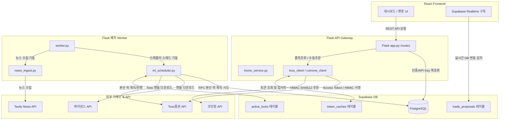
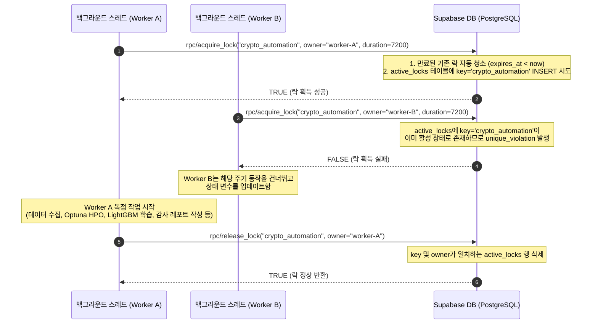

# Toss 메인 AI 트레이딩 시스템 흐름도 (System Workflow Guide)

본 문서는 Toss증권 Open API 및 코인원 API를 주요 거래소로 활용하는 AI 기반 트레이딩 보조 시스템의 데이터 아키텍처, 핵심 데이터 흐름, 주문 승인 단계, 그리고 스케줄러와 분산 락의 작동 메커니즘을 시각적으로 설명하여 모든 팀원들이 개발 및 운영 시 참고할 수 있도록 돕는 시스템 가이드라인입니다.

---

## 1. 전체 통신 및 데이터 흐름 아키텍처

시스템은 크게 **Vite React (프론트엔드)**, **Flask (API Gateway)**, **독립 Worker (백그라운드 스케줄러)**, **Supabase (데이터베이스 및 Auth)**, 그리고 **외부 거래소/정보 API**의 5가지 레이어로 구성됩니다.

---

## 2. 사용자 주문 제안 및 실행 승인 흐름 (Human-in-the-Loop)

AI 에이전트나 챗봇이 시장을 임의로 판단하여 실거래 주문을 수행하는 리스크를 방지하기 위해, 모든 거래는 **사용자의 명시적 승인**을 거쳐 동작합니다.

```mermaid
sequenceDiagram
    autonumber
    actor User as 사용자 (UI)
    participant Chatbot as LLM 챗봇 (LangChain)
    participant Flask as Flask 백엔드 API
    participant DB as Supabase DB
    participant Exchange as 외부 거래소 (Toss / 코인원)

    User->>Chatbot: "삼성전자 10주 매수 제안해줘"
    Chatbot->>Flask: 주문 사전검증 요청 (Buying Power, 수량 체크)
    Flask-->>Chatbot: 검증 성공 및 예상 금액 반환
    Chatbot->>DB: trade_proposals 테이블에 PENDING 상태로 주문 제안 등록
    Note over User, DB: 프론트엔드는 Realtime 기능으로 trade_proposals를 실시간 구독하고 있음
    DB-->>User: 챗봇 창에 [승인 / 거절] 액션 카드 자동 노출
    
    rect rgb(30, 41, 59)
        Note over User, Exchange: 최종 주문 승인 및 실행 단계
        User->>Flask: [승인] 버튼 클릭 (주문 실행 API 호출)
        Flask->>DB: 사용자의 암호화된 API Key 조회 및 대칭키 복호화
        Flask->>DB: 해당 주문의 멱등성 clientOrderId 검증 및 status = RUNNING 변경
        Flask->>Exchange: 최종 복호화된 토큰/서명으로 실거래 주문 전송
        Exchange-->>Flask: 주문 접수/체결 완료 응답
        Flask->>DB: trade_proposals 상태를 SUCCESS(또는 FAILED)로 갱신
        DB-->>User: 챗봇 화면에 "체결 성공" 상태 반영 및 계좌 잔고 갱신
    end
```

---

## 3. 백그라운드 스케줄러 독립 기동 및 분산 락 작동 흐름

Gunicorn의 멀티 프로세스(Multi-worker) 환경이나 여러 대의 분산 서버, 혹은 다중 개발자가 참여하는 개발 협업 환경에서 백그라운드 스케줄러(뉴스 수집, ML 자동화 학습 등)가 중복 기동되는 문제를 방지하기 위해 배치 스케줄러를 격리하고 **분산 락(Distributed Lock)**을 구성했습니다.

### 3.1 프로세스 격리 구조
* **`app.py` (API Gateway)**: `SCHEDULER_RUN_IN_GATEWAY=false`로 설정 시 내부 스레드 스케줄러 구동을 차단하여, 다중 웹서버 프로세스 상에서 스케줄러가 중복 기동되는 버그를 제거합니다.
* **`worker.py` (독립 워커)**: 오직 1개의 단독 백그라운드 데몬 프로세스로 띄워 모든 주기적 작업 스레드를 중앙 기동합니다.

### 3.2 `active_locks` 테이블 기반 분산 락 시퀀스

---

## 4. 토큰 DB 캐싱 패턴 (OAuth 2.0 Token Lifecycle)

Toss Open API 및 KIS API와 통신하기 위해 백엔드가 발급받는 OAuth 액세스 토큰은 로컬 파일이 아닌 Supabase `token_caches` 테이블에 일원화하여 캐싱 관리합니다.

1. **토큰 검증**: 백엔드가 API 호출 시 `token_cache_service`를 호출합니다.
2. **만료 검사**: DB 레코드의 `expired_at`과 현재 시각을 비교하여 캐싱 토큰 사용 가능 여부를 판별합니다.
3. **만료 시 재발급 및 Upsert**:
   * 토큰이 만료되었거나 존재하지 않는다면, `toss_client` 또는 `kis_client`가 각 거래소 토큰 갱신 엔드포인트를 호출합니다.
   * 발급받은 평문 토큰은 `CryptoHelper`의 AES-256 GCM 대칭키 방식을 통해 안전하게 암호화됩니다.
   * `ON CONFLICT (exchange, broker_env) DO UPDATE` 구문(Upsert)을 사용하여 기존 토큰 레코드를 새로운 암호화 토큰과 만료 일시로 덮어씁니다.
   * 이를 통해 여러 프로세스가 동시에 기동되더라도 한쪽이 갱신해둔 토큰을 DB에서 안전하게 공유할 수 있습니다.

---

## 5. 팀원을 위한 환경설정 최신화 규칙 (agents.md 21번 조항)
새로운 연동 API나 스케줄러 기능이 구현되면서 **환경 변수가 신규 추가되거나 갱신될 경우**:
* **루트 디렉토리의 `.env.example`** 파일에 해당 섹션명, 변수 설명, 교체용 예시값(`replace-me`)을 필수로 기재해야 합니다.
* 본인 외의 팀원이 변경 사항을 반영하지 않아 발생하는 로컬 빌드 깨짐 현상을 미연에 예방하기 위한 협업 약속입니다.
